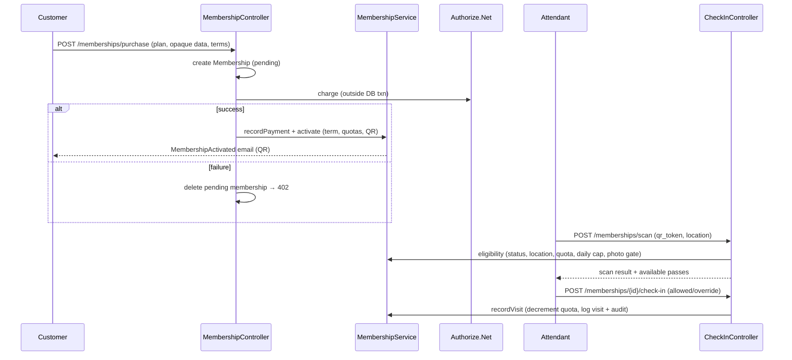
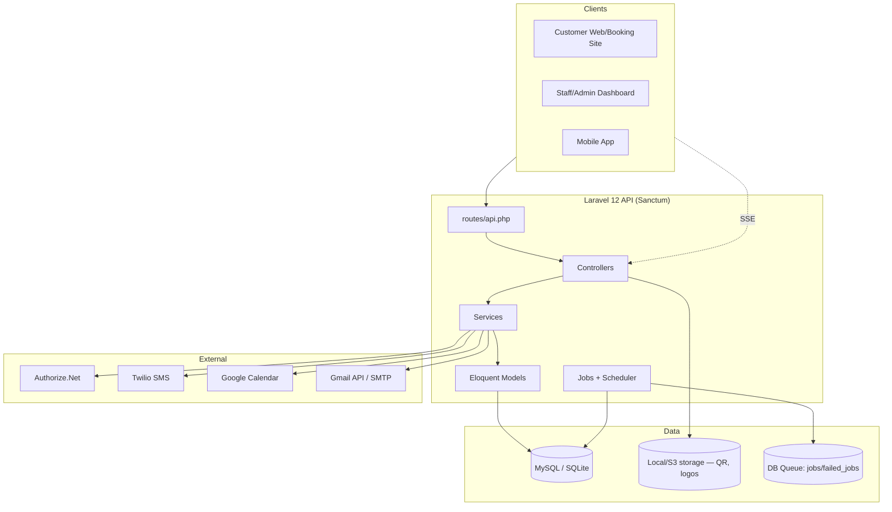
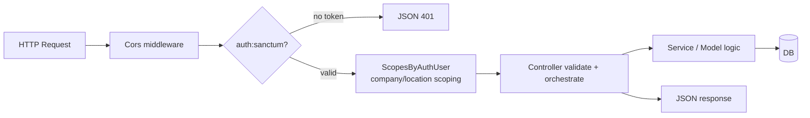
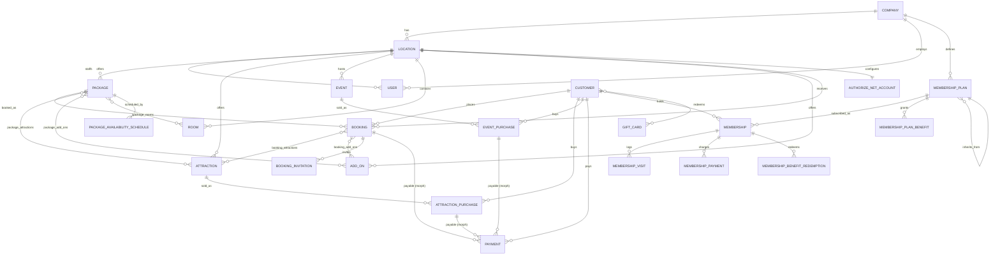
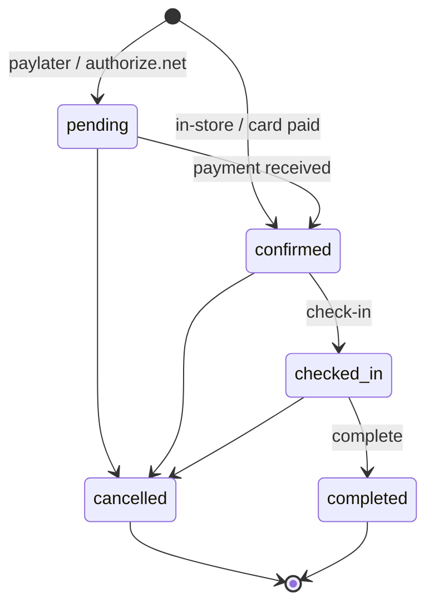
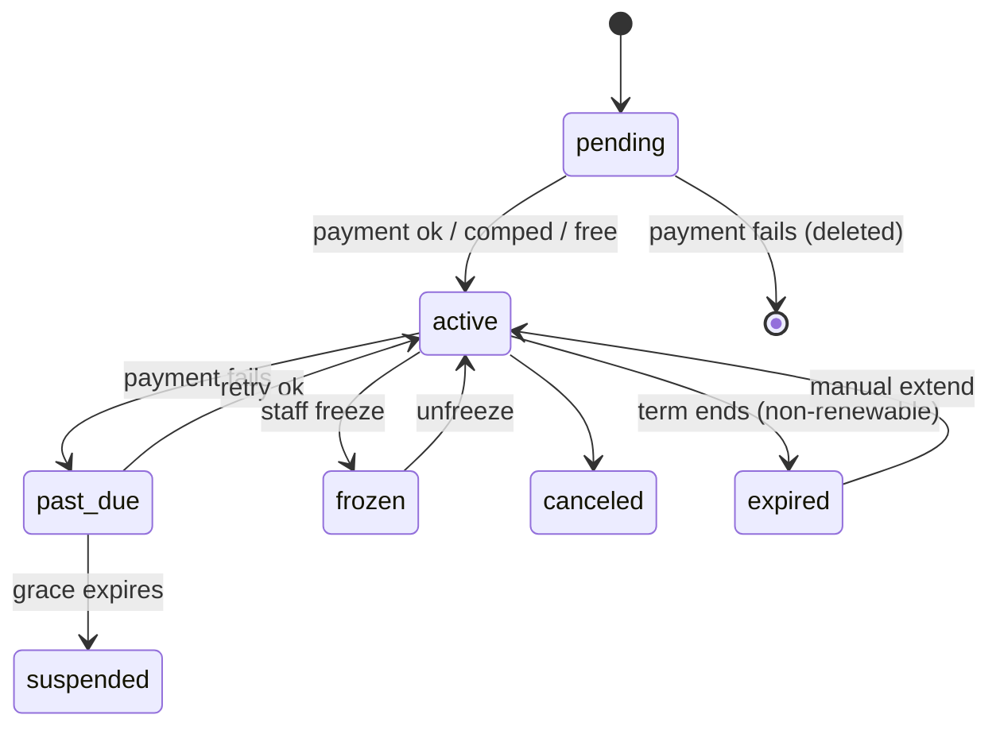

# Zap Zone Backend — System Overview

> A comprehensive, code-derived architecture reference for developers joining the Zap Zone backend project.
>
> **Stack:** Laravel 12 (PHP 8.2+) REST API · Laravel Sanctum auth · MySQL/SQLite · DomPDF · Authorize.Net · Twilio · Google Calendar / Gmail APIs
>
> Conclusions below are based on the actual source (controllers, models, migrations, services, config). Where a fact is inferred rather than explicit, it is marked **(assumption)**. File references use paths relative to the project root.

---

## Table of Contents

1. [What This System Is](#1-what-this-system-is)
2. [Architecture & Project Structure](#2-architecture--project-structure)
3. [Major Features](#3-major-features)
4. [API Reference (by Domain)](#4-api-reference-by-domain)
5. [Database Layer](#5-database-layer)
6. [Authentication & Security](#6-authentication--security)
7. [Integrations](#7-integrations)
8. [Primary Business Workflows](#8-primary-business-workflows)
9. [Architecture Diagrams](#9-architecture-diagrams)
10. [Environment Variables](#10-environment-variables)
11. [Developer Onboarding](#11-developer-onboarding)
12. [Known Observations](#12-known-observations)

---

## 1. What This System Is

### Business purpose

Zap Zone is a **family entertainment venue platform** (arcades / play zones / party venues). This backend is the **multi-tenant SaaS API** that powers booking, ticketing, payments, memberships, marketing, and operational analytics across many venues operated under one or more companies.

The core business problem it solves: let venue operators **sell and manage bookable experiences online and in-store** — party packages, individual attraction tickets, scheduled events, recurring memberships, gift cards, and promotions — while handling payment processing, room/time-slot availability, customer communications, and financial reporting.

### Tenancy model

```
Company  →  Location(s)  →  almost everything else
```

`Company` is the tenant root; `Location` (an individual venue) is the dominant scope for nearly all catalog and transactional data. See [Database Layer](#5-database-layer).

### Who uses it

There are **two distinct authentication principals** (both use Sanctum tokens, separate tables):

| Principal | Table | Roles | Typical actions |
|---|---|---|---|
| **Staff users** | `users` | `company_admin`, `location_manager`, `attendant` | Manage catalog, process bookings/payments, check-in guests, run reports, configure the venue |
| **Customers** | `customers` | (no role column) | Browse offerings, book/purchase, buy memberships, RSVP, view their own bookings |

In addition, **guests** (unauthenticated) can book and purchase via public endpoints with `guest_*` contact fields — guest checkout is first-class.

### Major workflows supported

- **Customer booking** of party packages (room + time slot + attractions + add-ons).
- **Payment** via per-location Authorize.Net merchant accounts (Accept.js tokenization), plus in-store / pay-later.
- **Attraction & Event purchases** (ticketing) paralleling bookings.
- **Memberships** — recurring subscriptions with benefits, passes, visit quotas, check-in.
- **Admin management** — catalog CRUD, staff management, availability/pricing config.
- **Marketing & comms** — email campaigns, transactional/triggered email, SMS, RSVP invitations.
- **Analytics & reporting** — page analytics, business analytics, accounting reconciliation, dashboards.

---

## 2. Architecture & Project Structure

### Architectural pattern

A **standard Laravel "fat-controller + service-object" layered MVC API**:

- **Routing:** a single flat API surface in [routes/api.php](routes/api.php) (~580 lines, ~44 controllers).
- **Controllers** (`app/Http/Controllers/Api/`): handle validation, orchestration, and response shaping. Many are large and contain substantial business logic directly (see [Known Observations](#12-known-observations)).
- **Service classes** (`app/Services/`): extracted logic for the most complex domains (memberships, benefits, payments gateway, email, analytics, calendar, invitations, CSV import).
- **Eloquent models** (`app/Models/`, 56 models): data + relationships + domain helper methods + query scopes. A lot of domain rules live in model methods (e.g. availability, pricing breakdowns, eligibility).
- **Traits** for cross-cutting concerns (tenant scoping, time-slot generation, analytics recording).
- **Jobs / Console commands** for scheduled and background work.
- **Mailables + Blade views** for email and PDF generation.

There is no formal repository/CQRS layer; persistence is direct Eloquent. Authorization is mostly **inline role checks + a scoping trait**, with one true Policy.

### Directory map

```
app/
├── Console/Commands/        # 4 scheduled/background commands
│   ├── SendBookingReminders.php
│   ├── PrunePageViews.php
│   ├── ResetMembershipUsage.php
│   └── ReEncryptAuthorizeNetCredentials.php
├── Http/
│   ├── Controllers/Api/     # ~44 API controllers (the bulk of the app)
│   ├── Middleware/Cors.php   # custom CORS handling
│   ├── Requests/            # 5 FormRequests (Package, AuthorizeNetAccount, schedules)
│   ├── Resources/           # 2 API Resources (Package, AuthorizeNetAccount)
│   └── Traits/
│       ├── ScopesByAuthUser.php       # multi-tenant query scoping + access guards
│       └── RecordsPageAnalytics.php   # conversion recording helper
├── Jobs/                    # PrunePageViews, ReEncryptAuthorizeNetCredentials, ResetMembershipUsage, SendBookingReminders
├── Mail/                    # 15 Mailable classes
├── Models/                  # 56 Eloquent models
├── Policies/AuthorizeNetAccountPolicy.php
├── Providers/AppServiceProvider.php
├── Services/                # 10 service classes
│   ├── AuthorizeNetPaymentService.php
│   ├── BookingCsvImportService.php
│   ├── EmailNotificationService.php
│   ├── GmailApiService.php
│   ├── GoogleCalendarService.php
│   ├── InvitationService.php
│   ├── MembershipBenefitService.php
│   ├── MembershipService.php
│   ├── PageAnalyticsRecorder.php
│   └── SmsService.php
├── Support/CompanyLocations.php
└── Traits/GeneratesAvailableTimeSlots.php

bootstrap/app.php            # middleware, schedule, exception handling (Laravel 12 style)
config/                      # app, auth, sanctum, cors, mail, gmail, google_calendar, twilio, queue, ...
database/migrations/         # 142 migration files
routes/api.php               # the entire API surface
resources/views/exports/     # Blade templates for PDF invoices/summaries/reports
resources/views/emails/      # Blade templates for emails
```

### Request lifecycle ([bootstrap/app.php](bootstrap/app.php))

- Global middleware: custom `App\Http\Middleware\Cors`.
- CSRF is **disabled for `api/*`** (token API, not session-cookie).
- Unauthenticated API requests return **JSON 401** (no redirect to a login page).
- **Scheduler** (registered in `bootstrap/app.php`):
  - `bookings:send-reminders` daily at **09:00**
  - `analytics:prune` daily at **03:30**
  - *(Note: `memberships:reset-usage` exists but is **not** registered in the scheduler — see [Known Observations](#12-known-observations).)*

---

## 3. Major Features

### 3.1 Catalog (Packages, Attractions, Events, Rooms, Add-ons)

**Purpose:** define the bookable/purchasable inventory of each venue.

- **Packages** — party/experience offerings (a base price, participant min/max, duration, package type `regular`/`custom`, guest-of-honor support, partial-payment config, booking-window and min-notice rules). Bundle **attractions**, **add-ons**, and **rooms** via pivots.
- **Attractions** — individual activities; can be bundled into packages *or* sold standalone (AttractionPurchase).
- **Events** — time-bound experiences with date ranges and per-slot capacity (`max_bookings_per_slot`); sold as EventPurchase.
- **Rooms** — physical spaces with `capacity`, `break_time`, `area_group`, and `booking_interval` (stagger) used by the availability engine.
- **Add-ons** — optional extras with `min/max_quantity`, per-package pricing overrides, and `is_force_add_on` (mandatory).
- **Categories** — light grouping metadata (global, not tenant-scoped).

**Key files:** `PackageController`, `AttractionController`, `EventController`, `RoomController`, `AddOnController`, `CategoryController`; models `Package`, `Attraction`, `Event`, `Room`, `AddOn`.

**Business rules:** soft-deletes on packages/events; price breakdowns combine base price + add-ons + fees − discounts; availability computed dynamically (below).

### 3.2 Availability Engine

**Purpose:** compute bookable time slots for a package on a date, respecting rooms, schedules, blackouts, and conflicts.

Driven by [app/Traits/GeneratesAvailableTimeSlots.php](app/Traits/GeneratesAvailableTimeSlots.php) plus `PackageAvailabilitySchedule` and `Room`. Three-layer conflict detection:

1. **Booking conflicts** against existing `PackageTimeSlot` records, plus a **15-minute cleanup buffer** after each booking.
2. **Break-time conflicts** from `room.break_time` (JSON of day + time ranges).
3. **Area-group stagger conflicts** — enforces `booking_interval` between adjacent bookings in the same `area_group`.

**Schedules** (`PackageAvailabilitySchedule`) support `daily`/`weekly`/`monthly` recurrence (incl. ordinal patterns like "first-monday"), with `time_slot_interval` (default 30 min) and `priority` to resolve overlaps. **DayOff** records block dates/times at location, package, or room granularity (full-day, close-early, delayed-opening, or time-range). **SpecialPricing** applies date/time-scoped discounts (fixed/percentage, one-time/weekly/monthly, stackable with priority). **FeeSupport** applies fees (fixed/percentage, additive or inclusive).

**Related endpoints:** `GET /package-time-slots/available-slots/{packageId}/{date}`, the `mobile/*` availability endpoints, `events/{event}/available-dates`, `events/{event}/available-time-slots/{date}`.

### 3.3 Bookings

**Purpose:** the central transaction — a customer/guest reserves a package at a date/time, optionally with a room, attractions, and add-ons.

- **Lifecycle:** `pending → confirmed → checked-in → completed`, with `cancelled` reachable from non-terminal states.
- **Payment status:** `pending` / `partial` / `paid` / (`refunded`/`voided` via payment actions).
- **Creation** (`BookingController::store`): validates guest-or-customer, package active, date/time/participants/amount; runs a **duplicate-detection window**; generates a unique `BK{YYYYMMDD}{rand}` reference; derives status from payment method (in-store/card → confirmed, paylater/authorize.net → pending); creates pivot rows (`BookingAttraction`, `BookingAddOn`), an optional `PackageTimeSlot`, membership redemptions, notifications, a CRM `Contact`, an `ActivityLog`, and (optionally) a Google Calendar event.
- **Related models:** `Booking`, `BookingAddOn`, `BookingAttraction`, `BookingInvitation`; polymorphic `Payment`.
- **Dependencies:** Catalog, Availability, Payments, Membership, Comms, Analytics.

### 3.4 Attraction & Event Purchases

**Purpose:** ticketing flows that parallel bookings for standalone attractions and scheduled events.

| | Booking | AttractionPurchase | EventPurchase |
|---|---|---|---|
| Sells | Package (room + slot) | Attraction (quantity) | Event tickets (per slot) |
| Status enum | pending/confirmed/checked-in/completed/cancelled | pending/confirmed/checked-in/cancelled/refunded | pending/confirmed |
| Ref no. | `BK…` | (own) | `EVT-…` |
| Add-ons | `booking_add_ons` | `attraction_purchase_add_ons` | `event_purchase_add_ons` |
| Payments | polymorphic `Payment` | polymorphic `Payment` | polymorphic `Payment` |

**Key files:** `AttractionPurchaseController`, `EventPurchaseController`; models `AttractionPurchase`, `EventPurchase` (+ their add-on pivots).

### 3.5 Payments

**Purpose:** charge, refund, void, and reconcile money across all three transaction types via a unified, polymorphic `Payment` entity.

- **Gateway:** **Authorize.Net**, with **per-location merchant accounts** (`AuthorizeNetAccount`) whose API Login ID / Transaction Key / public client key are **encrypted at rest** (Laravel `Crypt`). Frontend tokenizes cards with **Accept.js** (opaque data) — the backend never sees raw PANs.
- **Charge** (`PaymentController::charge`): resolves the location's active account, runs `authCaptureTransaction`, enforces **AVS** rules (hard-reject code `N` → auto-void; warn on `A/W/Z`), stores `card_last_four`, AVS/CVV codes, optional signature image + terms acceptance, then updates the payable's `amount_paid`/`payment_status` and transitions `pending → confirmed`.
- **Refund / Void / Manual refund:** full or partial refunds against settled transactions (with an automatic **void-fallback** when Authorize.Net reports an unsettled transaction `E00027`); voids for pre-settlement; `manualRefund` for non-gateway methods (cash/in-store). Full refunds/voids cancel the payable and reverse membership redemptions.
- **Partial payments / deposits:** `total_amount`, `amount_paid`, and package `partial_payment_percentage` / `partial_payment_fixed` support deposits; `payment_status` derives from `amount_paid >= total_amount`.
- **Invoices / receipts:** DomPDF-rendered invoices and booking summaries (download or inline stream), plus receipt emails with QR codes.

**Key files:** `PaymentController`, `AuthorizeNetAccountController`, `app/Services/AuthorizeNetPaymentService.php`, `StripeController` *(Stripe SDK is installed and a controller exists, but Authorize.Net is the active gateway — confirm Stripe usage before relying on it, **(assumption)**)*; models `Payment`, `AuthorizeNetAccount`.

### 3.6 Memberships

**Purpose:** recurring subscription product giving customers ongoing venue access and benefits. This is the **most complex subsystem**.

- **Plans** (`MembershipPlan`): pricing + billing cycle (monthly/quarterly/annual/one_time/custom), usage model (`limited`/`unlimited`/`limited_visits`/`punch_card`), per-term quotas, daily caps, **location access mode** (`single`/`multi`/`all`), grace/retry policy, cancellation mode, family/group flags, photo requirement, and **plan inheritance** (`inherits_plan_id`).
- **Benefits** (`MembershipPlanBenefit`): typed perks (package/attraction/event/addon discounts, free-entry & guest passes, priority booking, member-only access, birthday reward) with scope, value mode (percent/fixed/free/count/flag), period (`per_term`/`per_day`/`per_visit`/`once`/`lifetime`), stacking, priority, and conditions (min spend, day-of-week, blackout dates).
- **Lifecycle:** `pending → active`, then `past_due` (failed payment + grace), `frozen`, `canceled` (immediate/end-of-term), `expired` (non-renewable term end), `suspended` (grace lapsed).
- **Billing:** Authorize.Net Accept.js charges; on success resets term + sets `next_billing_at`; on failure → `past_due` with grace deadline and dunning email. Manual retry endpoint; refund/void of membership payments.
- **Check-in & redemption** (`MembershipCheckInController`): QR-scan eligibility (status/usability, location access, visit quota, daily cap, **photo hard-gate**), visit recording, and pass redemption (`MembershipBenefitService::redeemPass`).
- **Quote engine** (`MembershipBenefitService::quote`): computes applicable discounts for a basket of items.
- **Audit:** full before/after `MembershipAuditLog`; staff `MembershipNote`s; `MembershipVisit` log.
- **Rollover job:** `ResetMembershipUsage` rolls renewable terms, expires non-renewable, suspends past-grace, and enforces scheduled cancellations.

**Key files:** `MembershipController`, `MembershipPlanController`, `MembershipPlanBenefitController`, `MembershipCheckInController`, `MembershipReportController`; `app/Services/MembershipService.php`, `app/Services/MembershipBenefitService.php`; `app/Console/Commands/ResetMembershipUsage.php`; 9 membership models.

### 3.7 Marketing — Promos, Gift Cards, Contacts, Campaigns

- **Promos** (`PromoController`, `Promo`): fixed/percentage codes, single or **unique-batch** generation (up to 1000 codes/batch with CSV export + batch management), usage limits, validation, and apply-tracking (with page-analytics conversion events). Package-scoped via `package_promos`.
- **Gift cards** (`GiftCardController`, `GiftCard`): fixed/percentage cards with balance tracking, validation, redemption (decrements balance, notifies customer, logs activity), and deactivate/reactivate. Linked to packages and customers via pivots.
- **Contacts** (`ContactController`, `Contact`): a per-tenant CRM list (tags, source, SMS consent) auto-populated from bookings/purchases and used to target email campaigns.
- **Email campaigns** (`EmailCampaignController`, `EmailCampaign`): bulk marketing sends to targeted recipient sets, with templates, attachments, scheduling, test sends, and per-recipient logs.

### 3.8 Communications

Three distinct email subsystems (detailed in [Integrations](#7-integrations)):

1. **Transactional** — 15 `Mailable` classes (booking/membership/purchase confirmations, reminders, cancellations, invitations, staff credentials).
2. **Triggered notifications** — `EmailNotification` + `EmailNotificationService`: event-driven, templated, multi-recipient emails with 50+ variables and per-send logs.
3. **Campaigns** — bulk marketing (above).

Plus **SMS** (Twilio, used for invitations), **in-app notifications** (`Notification` / `CustomerNotification`), and **Server-Sent Events** streaming for near-real-time staff dashboards (`StreamController`).

### 3.9 RSVP & Party Invitations

`BookingInvitation` + `RsvpController` + `InvitationService`: a booking host invites guests (email and/or SMS) via unique RSVP tokens; guests respond at a **public** `GET/POST /rsvp/{token}` endpoint (attending/declined + guest count + optional marketing opt-in).

### 3.10 Analytics & Reporting

- **Page analytics** (`PageAnalyticsController`, `PageAnalyticsRecorder`, `PageView`): public client-side tracking of page views/conversions/engagement with sessions, funnels, attribution (first/last touch), device/geo, promo performance, live dashboard, and entity leaderboards.
- **Business analytics** (`AnalyticsController`): revenue/booking/utilization dashboards by company and location with exports.
- **Accounting analytics** (`AccountingAnalyticsController`): financial reconciliation — gross/net, fees, taxes (keyword-detected from `applied_fees`), discounts, balance due, gateway-collected amounts; `booked_on` vs `booked_for` view modes; CSV export.
- **Operational metrics** (`MetricsController`): real-time KPI dashboards per role.
- **Activity log** (`ActivityLogController`, `ActivityLog`): queryable staff audit trail (manually written at key actions).

### 3.11 Staff, Company & Location Administration

`CompanyController`, `LocationController`, `UserController` manage the tenancy and staff. Staff onboarding supports **credential emails** (`StaffAccountCredentialsMail`) and **shareable invite tokens** (`ShareableToken` + `ShareableTokenMail`).

---

## 4. API Reference (by Domain)

The entire surface is in [routes/api.php](routes/api.php). Everything inside the `Route::middleware('auth:sanctum')->group()` (from line ~216) is **protected**; everything above it is **public** unless it individually attaches `auth:sanctum`.

### 4.1 Authentication (public)
| Method | Path | Description |
|---|---|---|
| POST | `/login` | Staff/admin login (rejects `customer` role) → Sanctum token |
| POST | `/customer-login` | Customer login → Sanctum token |
| POST | `/customer-register` | Customer self-registration → Sanctum token |
| POST | `/logout` | Revoke all tokens *(protected)* |
| GET | `/user` | Current authenticated principal *(protected)* |

### 4.2 Public catalog & booking (unauthenticated)
| Method | Path | Description |
|---|---|---|
| GET | `/packages/grouped-by-name`, `/packages/{id}`, `/packages/location/{locationId}` | Browse packages |
| GET | `/attractions/grouped`, `/attractions/popular`, `/attractions/{id}`, `/attractions/location/{locationId}` | Browse attractions |
| GET | `/events`, `/events/grouped-by-name`, `/events/{event}`, `/events/{event}/available-dates`, `/events/{event}/available-time-slots/{date}` | Browse events + availability |
| GET | `/membership-plans/public` | Public membership plans |
| GET | `/locations` | List locations |
| GET | `/package-time-slots/available-slots/{packageId}/{date}` | Available slots |
| GET | `/mobile/locations`, `/mobile/locations/{id}/packages`, `/mobile/packages/{id}/availability` | Mobile availability |
| GET/POST | `/customers/search`, `/customers` | Find/create customer |
| POST | `/bookings`, `/bookings/{booking}/qrcode` | Create booking, attach QR |
| POST | `/attraction-purchases`, `/event-purchases` (+ qrcode, customer lists) | Create purchases |
| POST | `/payments/charge` | Charge a card (Authorize.Net) |
| GET/POST | `/rsvp/{token}` | View / submit RSVP |
| GET | `/special-pricings/for-entity`, `/fee-supports/for-entity`, `/day-offs/location/{locationId}` | Pricing/fee/blackout lookups |
| POST | `/analytics/track`, `/analytics/track/batch`, `/analytics/duration` | Page tracking (throttled 120/min) |

> ⚠️ **Public destructive routes exist** — `DELETE /bookings/{id}/force-delete`, `DELETE /attraction-purchases/{id}/force-delete`, `DELETE /event-purchases/{id}/force-delete`, and `POST /users` are all defined **outside** the auth group. See [Known Observations](#12-known-observations).

### 4.3 Protected — administration
- **Companies:** `apiResource('companies')` + `/statistics`, `/logo`.
- **Locations:** `store`, `show/update/destroy`, `/company/{id}`, `/toggle-status`, `/statistics`.
- **Users (staff):** `apiResource('users')` (except store) + `/staff` (create with credentials), `/resend-credentials`, `/company/{id}`, `/location/{id}`, `/role/{role}`, `/toggle-status`, `/update-email`, `/update-password`, `/update-profile-path`, `/bulk-delete`.
- **Customers:** `apiResource('customers')` (except store) + `/list/{user}`, `/analytics`, `/toggle-status`, `/statistics`, `/update-last-visit`.

### 4.4 Protected — catalog management
- **Packages:** full `apiResource` + restore/force, addons & attractions attach/detach, **availability-schedules** CRUD, bulk-import, reorder, category filter, toggle-status, room create, bulk min-notice update.
- **Attractions / Add-ons / Rooms / Categories / Day-offs / Special-pricings / Fee-supports / Global-notes:** `apiResource` + bulk operations, toggle-status, location filters, and (rooms) area-group booking-interval updates.

### 4.5 Protected — transactions & money
- **Bookings:** `apiResource` (except store/destroy) + cancel, check-in, complete, status, payment-status, internal-notes, search, by-location-date, summaries (day/week/export), details report, trashed/restore/force-delete, bulk delete/restore/import-csv, invitations sub-resource, summary PDF.
- **Attraction/Event purchases:** `apiResource` + status/confirm/cancel, check-in, verify, send-receipt, statistics, trashed/restore/force-delete, bulk ops.
- **Payments:** `apiResource` (except update) + refund, manual-refund, void, restore, force-delete, invoice (download/view), invoices report/export/day/week/bulk, trashed.

### 4.6 Protected — memberships
- **Self-service:** `/memberships/me`, `/memberships/mine/all`, `/memberships/purchase`, `/memberships/benefits/quote`.
- **Plans & benefits:** `apiResource('membership-plans')` + toggle-status; nested `/benefits` CRUD.
- **Lifecycle:** `/status`, `/freeze`, `/unfreeze`, `/cancel`, `/extend`, `/change-plan`, `/upgrade-plan`, `/payment-method`, `/retry-payment`, `/payments` (+ refund/void), `/photo`, `/notes`, `/eligibility`.
- **Check-in:** `/memberships/scan`, `/memberships/{id}/check-in`, `/memberships/{id}/redeem-pass`.
- **Reports:** `/membership-reports/summary`.

### 4.7 Protected — marketing & comms
- **Promos:** `apiResource` + validate-code, valid, apply, toggle-status, generate-bulk, batches (list/show/export-csv/deactivate/destroy).
- **Gift cards:** `apiResource` + validate-code, redeem, deactivate/reactivate.
- **Contacts:** index/store/show/update/destroy + tags, statistics, bulk import/delete/update, export-for-campaign, add/remove tag.
- **Email templates / campaigns / notifications:** full management incl. preview, send-test, duplicate, statistics, logs/resend, seed-defaults.
- **Notifications / Customer-notifications:** `apiResource` + mark-as-read / mark-all / unread-count / clear-all.

### 4.8 Protected — integrations & analytics
- **Authorize.Net account:** `/authorize-net/account` (CRUD), test-connection, public-key (public).
- **Google Calendar:** status, auth-url, disconnect, calendars, calendar, sync/resync, sync/{bookingId}, remove event.
- **Analytics:** `/analytics/company`, `/analytics/location` (+ export); `/accounting-analytics/report`, `/summary-trend`, `/export`; `/page-analytics/*` (overview, timeseries, top-pages/entities, sources, devices, funnel, conversions, events, live, landing-pages, searches, promo-performance, attribution, leaderboard, entity/session detail); `/metrics/dashboard/{user}`, `/metrics/attendant`.
- **Activity logs:** index/store/show.
- **Realtime (SSE, public):** `/stream/bookings`, `/stream/attraction-purchases`, `/stream/notifications`.

---

## 5. Database Layer

56 models, 142 migrations. The schema is **multi-tenant**, with `Company → Location` as the backbone and `location_id` as the dominant scope.

### 5.1 Entities by domain

**Tenancy / identity:** `companies`, `locations`, `users` (staff), `access_shareable_tokens`, `authorize_net_accounts` (encrypted creds, per-location), `google_calendar_settings`, framework `personal_access_tokens`/`sessions`.

**Customers:** `customers` (separate auth), `customer_notifications`, `customer_gift_cards`.

**Catalog:** `packages` *(soft-del)*, `attractions`, `events` *(soft-del)*, `rooms`, `add_ons`, `categories`, `package_availability_schedules`, `package_time_slots`, `special_pricing`, `day_offs`, `global_notes`. Pivots: `package_attractions`, `package_add_ons`, `package_rooms`, `package_gift_cards`, `package_promos`, `attraction_add_ons`, `event_add_ons`.

**Transactions:** `bookings` *(soft-del)*, `booking_attractions`, `booking_add_ons`, `booking_invitations`, `attraction_purchases` *(soft-del)*, `attraction_purchase_add_ons`, `event_purchases` *(soft-del)*, `event_purchase_add_ons`.

**Payments:** `payments` *(soft-del, polymorphic)*, `fee_support`.

**Membership:** `membership_plans` *(soft-del, self-referencing)*, `membership_plan_locations`, `membership_plan_benefits`, `membership_groups`, `memberships` *(soft-del)*, `membership_visits`, `membership_payments`, `membership_notes`, `membership_audit_logs`, `membership_benefit_redemptions` *(polymorphic)*.

**Marketing:** `promos`, `gift_cards`, `contacts`, `email_templates`, `email_campaigns` *(soft-del)*, `email_campaign_logs`, `email_notifications`, `email_notification_logs`.

**Analytics / system:** `page_views`, `notifications`, `activity_logs`, framework `cache`/`jobs`/`failed_jobs`.

### 5.2 Key relationships

- **Company** `hasMany` Location, User.
- **Location** `belongsTo` Company; `hasMany` Package/Attraction/Event/Room/AddOn/GiftCard/Booking/EventPurchase/Notification/User; `hasOne` AuthorizeNetAccount, GoogleCalendarSetting. *(Most tables FK here.)*
- **Customer** `hasMany` Booking, AttractionPurchase, EventPurchase, Payment, CustomerNotification, Membership; `belongsToMany` GiftCard.
- **Package** `belongsTo` Location; `hasMany` Booking, PackageAvailabilitySchedule; `belongsToMany` Attraction, AddOn, Room, GiftCard, Promo.
- **Booking** `belongsTo` Customer, Package (`withTrashed`), Location, Room, User×2 (creator/checked-in-by), GiftCard, Promo, Membership; `belongsToMany` Attraction, AddOn; `hasMany` BookingInvitation; **`morphMany` Payment**.
- **AttractionPurchase / EventPurchase** mirror Booking, each **`morphMany` Payment**.
- **Payment** **`morphTo` payable** (Booking | AttractionPurchase | EventPurchase); `belongsTo` Customer, Location.
- **MembershipPlan** `belongsTo` Company, Location, AuthorizeNetAccount, self (inheritsPlan); `belongsToMany` Location (approved); `hasMany` Membership, MembershipPlanBenefit.
- **Membership** `belongsTo` Customer, MembershipPlan, MembershipGroup, Location×2, User×2; `hasMany` MembershipVisit, MembershipPayment, MembershipNote, MembershipAuditLog, MembershipBenefitRedemption.

### 5.3 Polymorphic relationships

1. **`Payment.payable`** — true `morphTo` (Booking / AttractionPurchase / EventPurchase). Migration `2025_12_31_120000` converted the original `booking_id` FK into the `payable_id` + `payable_type` pair.
2. **`MembershipBenefitRedemption.redeemable`** — true `morphTo` recording what a benefit was applied against.
3. **Pseudo-polymorphic (typed columns, not a relation):** `PageView.entity_type/entity_id` and `ActivityLog.entity_type/entity_id`.

### 5.4 Important data-modeling facts

- **Guest checkout is first-class:** `bookings`, `attraction_purchases`, `event_purchases` have nullable `customer_id` + a parallel `guest_*` field set; accessor methods fall back guest → customer.
- **Soft-deletes** on packages, events, bookings, attraction/event purchases, payments, memberships, membership_plans, email_campaigns. `gift_cards` and `promos` instead use a manual `deleted` boolean (not the trait).
- **Money** stored as `decimal`; **JSON/array casts** used widely (`applied_fees`, `applied_discounts`, `features`, `image`, `break_time`, `tags`, `metadata`).
- **Schema evolved heavily via ALTERs** (142 migrations): e.g. `packages.image` string→longtext→json; payment-method enums repeatedly extended (`cash`→`in-store`, +`paylater`, +`authorize.net`); status enums extended; `notifications` migrated from `user_id`→`location_id`; availability columns moved into `package_availability_schedules`.

### 5.5 Data flow (high level)

```
Customer/Guest → Booking/Purchase (decrements availability via PackageTimeSlot)
              → Payment (polymorphic; Authorize.Net) → updates payable amount_paid/status
              → CustomerNotification + staff Notification + ActivityLog + Contact (CRM)
              → optional Google Calendar event + confirmation email (QR)
              → PageView conversion event recorded for analytics
```

---

## 6. Authentication & Security

### 6.1 Login flow (staff)

[AuthController::login](app/Http/Controllers/Api/AuthController.php):
1. Validate email + password (min 8).
2. Look up `User` by email; verify with `Hash::check`; **reject `customer` role**.
3. On failure return generic 401 (no user enumeration).
4. Load location, update `last_login`, write an `ActivityLog` (IP, UA, role, company/location).
5. Issue a Sanctum token: `$user->createToken($user->email)->plainTextToken`.

### 6.2 Customer login & registration

[AuthController::customerLogin / customerRegister](app/Http/Controllers/Api/AuthController.php): authenticates against the **`customers`** table (separate principal, no role). Registration validates unique email + confirmed password, hashes the password, sets `status='active'` immediately (**no email verification**), and returns a token right away.

### 6.3 Tokens

- **Mechanism:** Laravel Sanctum **personal access tokens** (Bearer), stored hashed in `personal_access_tokens`. Both `User` and `Customer` use `HasApiTokens`.
- **Expiration:** `config/sanctum.php` `expiration => null` → **tokens do not expire** until logout (`$user->tokens()->delete()`).
- **Abilities:** default (no granular scopes).

### 6.4 Roles & permissions

Staff roles (enum on `users.role`): **`company_admin`**, **`location_manager`**, **`attendant`**. (`super_admin` is referenced in a couple of code paths but is **not** in the DB enum — effectively dead.)

| Capability | company_admin | location_manager | attendant |
|---|---|---|---|
| Scope | whole company | their location | their location |
| Create staff | any role | location_manager/attendant *(in their location)* | ✗ |
| Manage catalog/config | ✓ | ✓ (location) | limited |
| Check-in / operate | ✓ | ✓ | ✓ |

### 6.5 Multi-tenancy & scoping

[app/Http/Traits/ScopesByAuthUser.php](app/Http/Traits/ScopesByAuthUser.php) provides:
- `applyAuthScope()` — `location_manager`/`attendant` filtered by `company_id` **and** `location_id`; `company_admin` by `company_id` only.
- `authorizeRecordScope()`, `guardLocationAccess()`, `guardCompanyAccess()` — return 403 on cross-tenant access.

[app/Policies/AuthorizeNetAccountPolicy.php](app/Policies/AuthorizeNetAccountPolicy.php) is the one formal Policy (requires `location_id` + manager/admin role, exact location match).

### 6.6 Public vs protected boundary

The security boundary is the `auth:sanctum` route group. Public surface includes catalog browsing, booking/purchase creation, payment charge, RSVP, customer create/search, page-tracking, and SSE streams. See [§4.2](#42-public-catalog--booking-unauthenticated) and the warning there.

### 6.7 Security concerns (summary — see §12 for detail)

- **Tokens never expire** (`sanctum.expiration = null`).
- **Public destructive routes:** `force-delete` for bookings/attraction-purchases/event-purchases, and **`POST /users`** outside the auth group.
- **Unauthenticated debug routes** `GET /authorize-net/debug/{locationId}` and `/debug-test/{locationId}` leak gateway metadata / validate credentials.
- **No email verification** for customer registration.
- **Password change does not revoke tokens.**
- CORS logic is duplicated between `config/cors.php` and the custom `Cors` middleware (which can fall back to `*`).

---

## 7. Integrations

### 7.1 Payments — Authorize.Net
Per-location merchant accounts (`AuthorizeNetAccount`, encrypted creds), Accept.js opaque-data tokenization, `authCaptureTransaction`, AVS/CVV enforcement, refunds/voids with unsettled-transaction fallback. Global endpoints in `config/services.php`. **Stripe** SDK + `StripeController` are present but Authorize.Net is the active path **(assumption — verify before using Stripe)**.

### 7.2 Email
Three subsystems:
1. **Transactional `Mailable`s (15):** `BookingConfirmation`, `BookingReminder`, `BookingCancellation`, `StaffBookingNotification`, `AttractionPurchaseReceipt`, `AttractionPurchaseCancellation`, `EventPurchaseConfirmation`, `MembershipActivated`, `MembershipCanceled`, `MembershipPaymentFailed`, `MembershipPaymentReceipt`, `PartyInvitation`, `ShareableTokenMail`, `StaffAccountCredentialsMail`, `DynamicCampaignMail`. Many attach QR codes / invitation PDFs.
2. **Triggered notifications:** `EmailNotificationService` + `EmailNotification`/`EmailNotificationLog` — event-driven, templated (`{{variable}}`), multi-recipient (customer/staff/manager/admin/custom), auto-seeded defaults, per-send logging.
3. **Campaigns:** `EmailCampaign`/`EmailCampaignLog` bulk marketing with templates, attachments, scheduling, test sends.

**Transport:** Gmail API (`GmailApiService`, service-account, `USE_GMAIL_API`) with **SMTP fallback** (`config/mail.php`). Gmail path supports inline images (CID) and attachments.

### 7.3 SMS — Twilio
`app/Services/SmsService.php` (config `config/twilio.php`): phone normalization + send; used by `InvitationService` for RSVP invitations. No-ops gracefully if unconfigured.

### 7.4 Google Calendar
OAuth2 (app credentials in `config/google_calendar.php`); per-location `GoogleCalendarSetting` stores access/refresh tokens (hidden from API). `GoogleCalendarService` + `GoogleCalendarController` provide connect/disconnect, calendar selection, and booking sync/resync (auto-sync on booking create/cancel when enabled).

### 7.5 File storage
Default `local` disk (`FILESYSTEM_DISK`); QR codes written to `storage/app/public/qrcodes/`. S3/AWS env keys are present in `config/filesystems.php` but not the default.

### 7.6 Background jobs, queues & scheduler
- **Queue:** database driver (`jobs`/`failed_jobs` tables); Mailables are `Queueable`. Redis/SQS/Beanstalkd configured but not default.
- **Scheduler** (`bootstrap/app.php`): `bookings:send-reminders` @09:00, `analytics:prune` @03:30.
- **Commands/Jobs:** `SendBookingReminders` (tomorrow's bookings, idempotent via `reminder_sent`), `PrunePageViews` (>365d, batched), `ResetMembershipUsage` (term rollover — **not scheduled**, run manually), `ReEncryptAuthorizeNetCredentials` (credential re-encryption maintenance).

### 7.7 Realtime — Server-Sent Events
`StreamController` polls the DB every ~3s (60s max runtime, heartbeats) to stream new bookings / attraction purchases / combined notifications to staff dashboards.

---

## 8. Primary Business Workflows

### 8.1 Customer booking flow

```mermaid
sequenceDiagram
    participant C as Customer/Guest
    participant API as BookingController
    participant Avail as Availability Engine
    participant DB as Database
    participant Pay as PaymentController (Authorize.Net)
    participant Cal as Google Calendar
    participant Mail as Email/Notifications

    C->>Avail: GET available slots (package, date)
    Avail-->>C: open slots (room-aware, conflict-checked)
    C->>API: POST /bookings (package, slot, attractions, add-ons, guest/customer)
    API->>API: validate + duplicate-window check + gen reference
    API->>DB: create Booking (+ pivots, PackageTimeSlot)
    API->>DB: membership redemptions, Contact, ActivityLog, Notifications
    alt pay now (card)
        C->>Pay: POST /payments/charge (Accept.js opaque data)
        Pay->>Pay: AVS/CVV checks, authCapture
        Pay->>DB: Payment (polymorphic) → amount_paid/status; pending→confirmed
    else in-store / paylater
        API->>DB: status per method
    end
    API->>Cal: sync event (if enabled)
    API->>Mail: confirmation email (QR) + staff alert
```

### 8.2 Payment flow

1. Frontend tokenizes the card with **Accept.js** → opaque data.
2. `POST /payments/charge` with `location_id`, `payable_id/type`, amount, billing, opaque data.
3. Backend resolves the **location's active `AuthorizeNetAccount`** (decrypts creds), runs `authCaptureTransaction`.
4. **AVS** hard-reject (`N`) → auto-void; warn (`A/W/Z`) → proceed with logging.
5. Persist `Payment` (card_last_four, AVS/CVV, signature, terms); recompute payable `amount_paid` → `paid`/`partial`; transition `pending → confirmed`.
6. Send receipt email (+QR) and notifications; record analytics conversion.
7. **Refund/void** reverse amounts, cancel the payable on full refund, and reverse membership redemptions; unsettled refunds fall back to void.

### 8.3 Event / attraction purchase flow

Same shape as booking, against `AttractionPurchase` / `EventPurchase` (quantity/tickets instead of room+slot; `EVT-` reference for events). Payments are the same polymorphic flow.

### 8.4 Membership purchase & check-in



Recurring billing: on success resets the term and sets `next_billing_at`; on failure → `past_due` + grace + dunning email. The `ResetMembershipUsage` command rolls terms, expires non-renewable plans, suspends past-grace memberships, and applies scheduled cancellations.

### 8.5 Admin management flow

Staff (scoped by role/tenant) authenticate via `/login`, then manage catalog (packages/attractions/events/rooms/add-ons), availability (schedules/day-offs/special-pricing/fees), pricing, promos/gift cards, memberships, and run analytics/exports. New staff are onboarded via credential emails or shareable invite tokens. Realtime SSE feeds surface new bookings on dashboards.

### 8.6 RSVP / party invitation flow

Host creates `BookingInvitation`s for a booking → `InvitationService` sends email (`PartyInvitation`) and/or SMS with a unique token → guest opens public `/rsvp/{token}`, submits attending/declined + guest count → status + counts update on the booking.

---

## 9. Architecture Diagrams

### 9.1 High-level system architecture



### 9.2 Request flow (protected endpoint)



### 9.3 Entity-relationship (core entities)



### 9.4 Booking status lifecycle



### 9.5 Membership lifecycle



---

## 10. Environment Variables

> Source: `.env.example` and `config/*`. Per-location payment & calendar credentials live **in the database**, not env.

### Core application
| Var | Purpose |
|---|---|
| `APP_NAME`, `APP_ENV`, `APP_KEY`, `APP_DEBUG`, `APP_URL` | Standard Laravel app config (`APP_KEY` also encrypts gateway creds) |
| `APP_LOCALE`, `APP_FALLBACK_LOCALE` | Localization |
| `BCRYPT_ROUNDS` | Password hashing cost |
| `LOG_CHANNEL`, `LOG_LEVEL` | Logging |

### Database & cache
| Var | Purpose |
|---|---|
| `DB_CONNECTION` (sqlite default), `DB_HOST/PORT/DATABASE/USERNAME/PASSWORD` | Database. **Use MySQL in production (assumption).** |
| `CACHE_STORE`, `REDIS_HOST/PORT/PASSWORD` | Cache / Redis (predis installed) |
| `SESSION_DRIVER`, `SESSION_LIFETIME` | Sessions |
| `QUEUE_CONNECTION` (database) | Queue driver |

### Mail / Gmail API
| Var | Purpose |
|---|---|
| `MAIL_MAILER`, `MAIL_HOST/PORT/USERNAME/PASSWORD`, `MAIL_FROM_ADDRESS/NAME` | SMTP fallback transport |
| `USE_GMAIL_API` | Toggle Gmail API sending |
| `GMAIL_SENDER_EMAIL`, `GMAIL_SENDER_NAME` | Gmail "from" identity |
| `GMAIL_PROJECT_ID`, `GMAIL_PRIVATE_KEY_ID`, `GMAIL_PRIVATE_KEY`, `GMAIL_CLIENT_EMAIL`, `GMAIL_CLIENT_ID`, `GMAIL_CLIENT_CERT_URL`, `GMAIL_CREDENTIALS_PATH` | Gmail service-account credentials |

### SMS (Twilio)
| Var | Purpose |
|---|---|
| `TWILIO_SID`, `TWILIO_AUTH_TOKEN`, `TWILIO_FROM_NUMBER` | Twilio SMS credentials + sender |

### Google Calendar
| Var | Purpose |
|---|---|
| `GOOGLE_CALENDAR_CLIENT_ID`, `GOOGLE_CALENDAR_CLIENT_SECRET` | OAuth2 app credentials |
| `GOOGLE_CALENDAR_FRONTEND_REDIRECT_URL` | Post-auth redirect |
| `GOOGLE_CALENDAR_AUTO_SYNC` | Auto-sync bookings (default true) |

### Payments
| Var | Purpose |
|---|---|
| *(per-location, in DB)* | Authorize.Net API Login ID / Transaction Key / public client key — encrypted on `authorize_net_accounts` |
| `SANCTUM_TOKEN_PREFIX` | Optional Sanctum token prefix |

### File storage / AWS
| Var | Purpose |
|---|---|
| `FILESYSTEM_DISK` (local) | Default disk |
| `AWS_ACCESS_KEY_ID`, `AWS_SECRET_ACCESS_KEY`, `AWS_DEFAULT_REGION`, `AWS_BUCKET`, `AWS_USE_PATH_STYLE_ENDPOINT` | S3 (if used) |

### Optional / other
`POSTMARK_TOKEN`, `RESEND_KEY`, `SLACK_BOT_USER_OAUTH_TOKEN`/`SLACK_BOT_USER_DEFAULT_CHANNEL` (configured in `config/services.php`, not necessarily wired up).

---

## 11. Developer Onboarding

### Tech stack
- **Language/runtime:** PHP **8.2+**
- **Framework:** **Laravel 12** (`laravel/framework ~12.48`)
- **Auth:** Laravel **Sanctum 4**
- **DB:** SQLite (dev default) / MySQL (production **(assumption)**)
- **PDF:** `barryvdh/laravel-dompdf`
- **Payments:** `authorizenet/authorizenet` (active), `stripe/stripe-php` (present)
- **SMS:** `twilio/sdk`
- **Google:** `google/apiclient` (Calendar + Gmail)
- **Spreadsheets:** `phpoffice/phpspreadsheet` (imports/exports)
- **Cache/queue:** `predis/predis` (Redis optional)
- **Dev tooling:** Pint (lint), PHPUnit 11, Pail (log tail), Sail, Faker

### Project structure
See [§2](#2-architecture--project-structure). Mental model: **routes → controller (validate/orchestrate) → service/model (business logic) → Eloquent → DB**, with jobs/commands for scheduled work and Mailables/Blade for email & PDF.

### Run locally
```bash
composer install
cp .env.example .env
php artisan key:generate
# SQLite (default): create the file, then migrate
touch database/database.sqlite
php artisan migrate

# Frontend assets (if needed)
npm install && npm run build

# One-shot dev (server + queue + logs + vite):
composer dev
# (runs: php artisan serve | queue:listen | pail | npm run dev)
```
- For **MySQL**, set `DB_CONNECTION=mysql` + credentials before migrating.
- For **payments/email/SMS/calendar**, populate the relevant env vars (Gmail/Twilio/Google) and create per-location `AuthorizeNetAccount` rows.
- **Queue worker** is required for emails/jobs: `php artisan queue:listen` (included in `composer dev`).
- **Scheduler** (prod): run `php artisan schedule:run` every minute via cron. Remember `memberships:reset-usage` is **not** in the schedule — add it or run via cron separately.

### Run tests
```bash
composer test     # config:clear + php artisan test (PHPUnit)
```

### Deploy
- Targets **Laravel Forge** (CORS/middleware reference Forge staging domains; configs mention Forge). Standard Laravel deploy: `composer install --no-dev`, `php artisan migrate --force`, config/route/view cache, queue worker (Horizon/supervisor or `queue:work`), scheduler cron.
- Set all production env vars; ensure `APP_KEY` is stable (it decrypts stored gateway credentials — rotating it requires re-encryption, cf. `ReEncryptAuthorizeNetCredentials`).
- `storage/app/public` must be linked (`php artisan storage:link`) for QR codes/logos.

### Conventions
- **API-only** surface (no Blade web UI except PDF/email templates); JSON responses; `api/*` is CSRF-exempt.
- **Tenant scoping** via `ScopesByAuthUser` — apply it when adding list/detail endpoints.
- **Guest-or-customer** duality: support nullable `customer_id` + `guest_*` fields on new transactional tables.
- **Money** as `decimal`; **flexible pricing** as `applied_fees`/`applied_discounts` JSON arrays.
- **Soft-deletes** for transactional/catalog tables; some legacy tables use a `deleted` boolean flag instead.
- **Payments are polymorphic** — attach new payable types via `morphMany Payment` + the `Payment::TYPE_*` constants.
- **Activity logging** is **manual** — call `ActivityLog::log(...)` at significant actions.
- **Lint** with Pint before committing.

---

## 12. Known Observations

> Engineering notes for maintainers — potential technical debt, risk areas, and refactoring opportunities. These are observations from a static read; validate before acting.

### Security risks (prioritize)
1. **Public destructive & creation routes.** `DELETE /bookings/{id}/force-delete`, `/attraction-purchases/{id}/force-delete`, `/event-purchases/{id}/force-delete`, and **`POST /users`** sit outside `auth:sanctum` ([routes/api.php](routes/api.php) ~162, 168, 198, 172). The force-deletes guard only on "pending" status with no ownership check; `POST /users` can create staff accounts unauthenticated. **Recommend:** move into the auth group + ownership/role checks.
2. **Unauthenticated debug endpoints.** `GET /authorize-net/debug/{locationId}` and `/debug-test/{locationId}` expose gateway metadata and live-validate credentials for any location id. **Recommend:** remove or lock behind admin auth.
3. **Non-expiring tokens.** `config/sanctum.php` `expiration => null`. **Recommend:** set a TTL; revoke tokens on password change (currently `updatePassword` does not call `tokens()->delete()`).
4. **No customer email verification** — `customer-register` activates immediately.
5. **CORS duplication** between `config/cors.php` and the custom `Cors` middleware (which can fall back to `*`). Consolidate.
6. **Dead `super_admin` role** referenced in code but absent from the `users.role` enum — checks against it never match, creating a false sense of capability.

### Large modules / complexity hotspots
- **`PaymentController`** (~2,900 lines) — charge/refund/void/manual-refund/invoices all in one class; heavy Authorize.Net SDK use inline.
- **`BookingController`** (~2,000+ lines) — store + lifecycle + exports + reports + summaries.
- **`AnalyticsController`** (~1,366 lines) and **`AccountingAnalyticsController`** (~874 lines) — large aggregation methods, some DB-engine-specific SQL.
- **`MembershipController`** + membership services — the richest domain; logic split across controller and two services, which is good, but the controller still carries gateway code.
- **`EmailNotificationService`** (~1,000 lines) with 50+ template variables.

These are candidates for extracting **service/action classes**, **form requests**, and **API resources** (currently only 2 FormRequests-worth of validation are extracted; most validation is inline).

### Coupling concerns
- **Controllers do a lot directly** (validation, gateway calls, notifications, calendar sync, analytics) — business logic is coupled to HTTP. Extracting domain services/events would improve testability.
- **Gateway code in multiple places** — `PaymentController`, `MembershipController`, and `AuthorizeNetPaymentService` each touch the Authorize.Net SDK. Consolidate behind the service.
- **Status/enum strings are stringly-typed** and validated inline per controller; repeated enum extensions via migrations suggest these should be PHP enums/constants centralized on the models.
- **Manual `deleted` boolean** on `gift_cards`/`promos` diverges from the SoftDeletes trait used elsewhere — two deletion paradigms to remember.

### Operational gaps
- **`memberships:reset-usage` is not scheduled** in `bootstrap/app.php` — membership term rollover, expiry, suspension, and scheduled-cancellation enforcement will **not run** unless added to the scheduler or a separate cron. **High-impact:** confirm this is wired in production.
- **SSE via DB polling** (`StreamController`, 3s) — workable at small scale but will add DB load; consider a real broadcast driver (Reverb/Pusher/Redis) as usage grows.
- **Base64 images stored in columns** (company logo, user profile, up to ~20 MB) — memory-heavy; prefer file storage + references.

### Documentation / testing gaps
- **No OpenAPI/Swagger** spec; the API contract lives only in `routes/api.php` + controller validation. Consider generating one.
- **Test coverage appears minimal** (default Laravel test scaffolding) for a system this size — high-value targets: payment charge/refund, availability conflict detection, membership lifecycle/billing, tenant scoping.
- **Inline debug routes/closures** in `routes/api.php` should be removed before/around production.

---

*Generated from static analysis of the codebase. Line-level references were accurate at the time of writing; verify against current source when making changes.*
