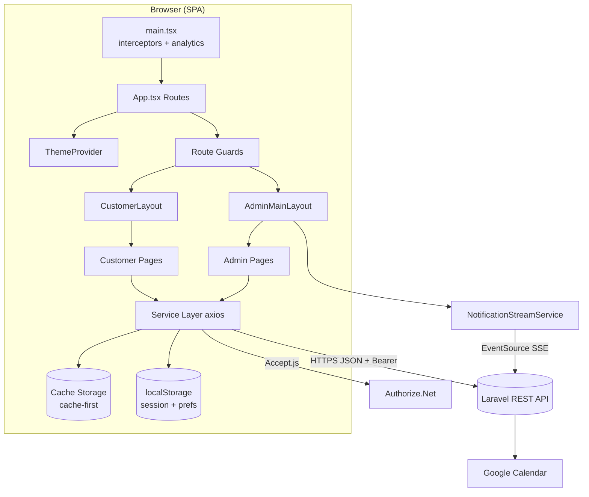
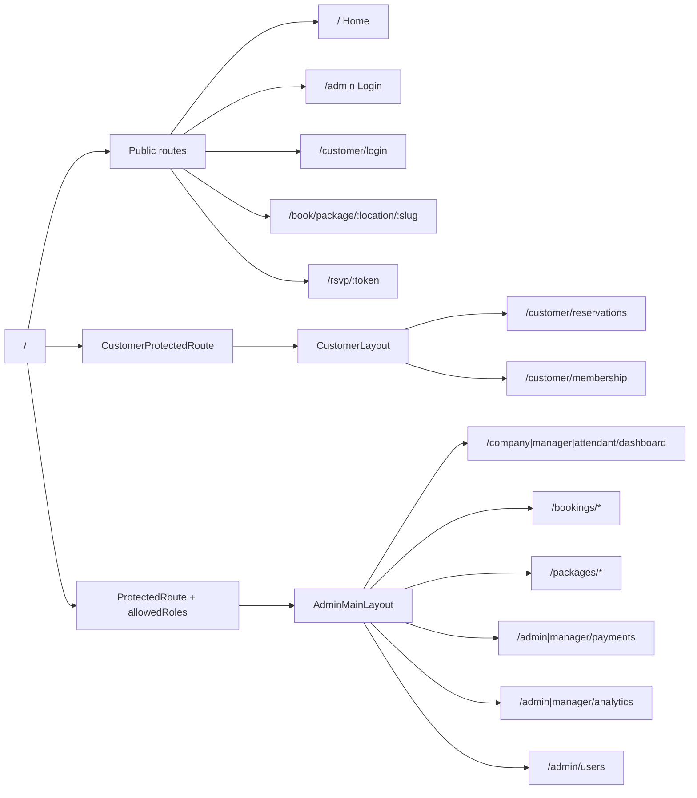
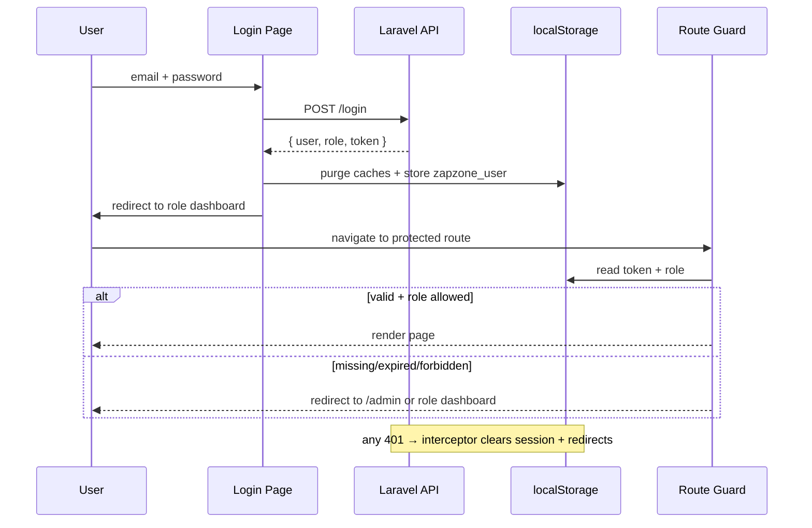
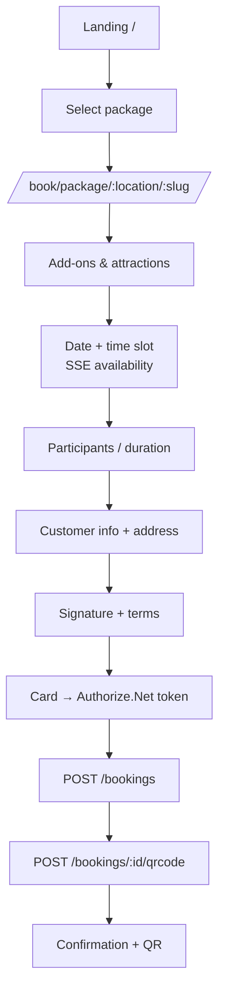
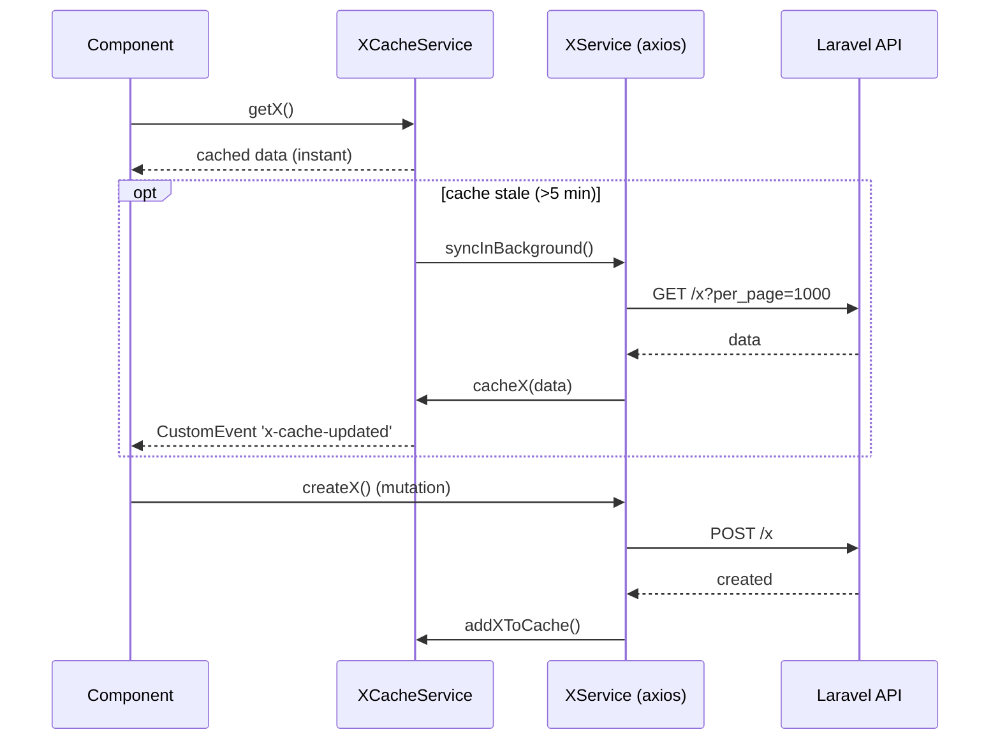
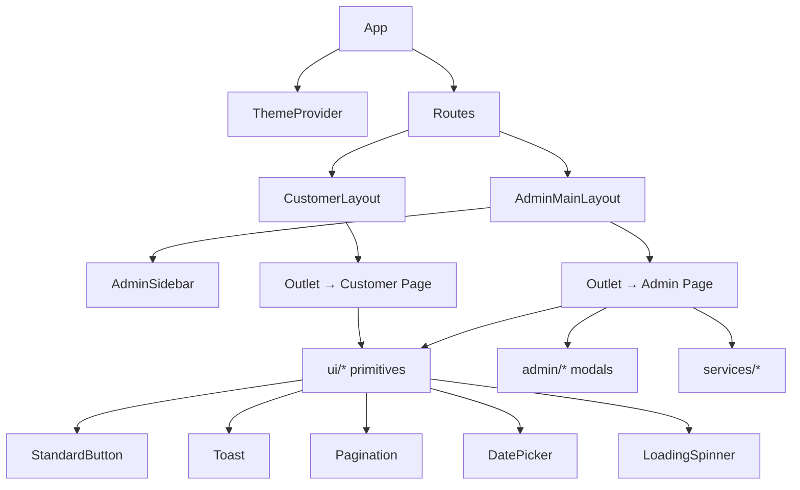

# Zap Zone (Zappoint) — Frontend Overview

> A comprehensive technical and business reference for the `booking-frontend` single-page application.
> Audience: developers joining the project. Everything below is derived from the actual source code in `src/`.

---

## Table of Contents

1. [Project Purpose](#1-project-purpose)
2. [Technology Stack](#2-technology-stack)
3. [Project Structure](#3-project-structure)
4. [Screens & Pages](#4-screens--pages)
5. [User Journeys](#5-user-journeys)
6. [Component Architecture](#6-component-architecture)
7. [State Management](#7-state-management)
8. [API Integration](#8-api-integration)
9. [Authentication & Authorization](#9-authentication--authorization)
10. [Forms & Validation](#10-forms--validation)
11. [Environment Configuration](#11-environment-configuration)
12. [Frontend-to-Backend Relationship](#12-frontend-to-backend-relationship)
13. [UI/UX Architecture](#13-uiux-architecture)
14. [Mermaid Diagrams](#14-mermaid-diagrams)
15. [Developer Onboarding](#15-developer-onboarding)
16. [Known Observations](#16-known-observations)

---

## 1. Project Purpose

### What this product is

**Zap Zone** is a multi-location **entertainment venue booking and management platform**. The
`package.json` name is `booking-frontend`, and stored data keys are prefixed `zapzone_`
([src/utils/auth.ts](src/utils/auth.ts), [src/utils/storage.ts](src/utils/storage.ts)). The public site links to
`https://zap-zone.com` ([src/pages/auth/Login.tsx](src/pages/auth/Login.tsx#L210)) and tax logic references
"Michigan tax" ([src/components/embed/BookingWidget.tsx](src/components/embed/BookingWidget.tsx#L198)) and a
"Michigan timezone" helper (`getMichiganNow`), indicating a US/Michigan-based family entertainment center
operator (laser tag, arcade, party rooms, attractions).

### What the application does

The system manages the full commercial lifecycle of an entertainment venue:

- **Packages** — bookable party/experience packages with attractions, add-ons, rooms, time-slot scheduling.
- **Attractions** — individually ticketed activities (purchases + check-in).
- **Events** — ticketed events with onsite and online purchase.
- **Memberships** — recurring membership plans, benefits, check-in, freeze/cancel.
- **Gift cards & promos** — discount and stored-value instruments.
- **Payments** — charge, refund, void, invoicing (Authorize.Net gateway).
- **Email marketing** — templates, campaigns, automated trigger-based notifications.
- **Analytics** — company/location performance, accounting reports, and web page analytics.

### Types of users

The application serves **two distinct audiences**, each with its own layout, auth store, and routes:

| Audience | Roles | Auth store | Entry route |
|----------|-------|-----------|-------------|
| **Staff / Admin** | `company_admin`, `location_manager`, `attendant` | `localStorage['zapzone_user']` | `/admin` (login) |
| **Customers** | end customers (and guests) | `localStorage['zapzone_customer']` | `/` (landing) |

Roles are defined in [src/utils/auth.ts](src/utils/auth.ts#L15):
`role: 'attendant' | 'location_manager' | 'company_admin'`.

- **Company Admin** — full access across all locations (user management, company analytics, payments).
- **Location Manager** — single-location operations (attendants, memberships, payments, analytics for their location).
- **Attendant** — front-line operations (bookings, check-in, packages, attractions, events).

### How the frontend fits into the overall system

This is a **pure client-side SPA** (Vite + React) that talks to a **Laravel REST API backend** over HTTPS
(JSON + Bearer token). Evidence:
- API base URL points at a Laravel Forge host: `https://zapzone-backend-yt1lm2w5.on-forge.com/api`
  ([src/utils/storage.ts](src/utils/storage.ts#L1)).
- Backend serves uploaded assets from a Laravel `/storage/` path (`ASSET_URL`, [src/utils/storage.ts](src/utils/storage.ts#L11)).
- Endpoints, pagination shape (`current_page`/`last_page`/`per_page`), and soft-delete semantics
  (`trashed`, `restore`, `force-delete`) are Laravel idioms.

The frontend additionally exposes an **embeddable booking widget** (`/embed/bookingWidget.js`) so the
booking experience can be dropped into external/marketing sites.

---

## 2. Technology Stack

All versions are from [package.json](package.json).

### Frameworks & core

| Dependency | Version | Role |
|-----------|---------|------|
| **react** / **react-dom** | ^19.1.1 | UI framework (React 19, function components + hooks only) |
| **react-router-dom** | ^7.8.2 | Client-side routing (`BrowserRouter`, nested routes, route guards) |
| **vite** | ^7.1.2 | Dev server + build tool (ESM, fast HMR) |
| **typescript** | ~5.8.3 | Static typing (strict mode enabled) |

### Styling / UI

| Dependency | Role |
|-----------|------|
| **tailwindcss** ^4.1.13 + **@tailwindcss/vite** | Utility-first CSS via the Vite plugin (Tailwind v4) |
| **lucide-react** ^0.542 | Primary icon set |
| **@heroicons/react** ^2.2 | Secondary icon set |

There is **no third-party component library** (no MUI/Chakra/Ant). All UI components are hand-built
under `src/components/ui/` with Tailwind classes.

### Data, forms & state

| Dependency | Role |
|-----------|------|
| **axios** ^1.11 | HTTP client; each service creates its own instance with auth interceptor |
| _(none)_ | **No Redux/Zustand/React Query.** State = React hooks + Cache Storage services + `localStorage` |
| _(native)_ | Forms use plain controlled inputs + manual validation (no Formik/react-hook-form) |

### Domain-specific libraries

| Dependency | Where used |
|-----------|-----------|
| **recharts** ^3.2 | Analytics dashboards (line/bar/pie/area charts) |
| **qrcode** ^1.5 / **qrcode.react** ^4.2 | Generate QR codes for bookings, tickets, memberships |
| **html5-qrcode** ^2.3 | Camera-based QR scanning at check-in desks |
| **jspdf** ^3.0 + **html2canvas** ^1.4 | Export invoices/PDFs from payment screens |
| **react-signature-canvas** ^1.1 | Capture digital signatures on bookings/waivers |
| **@uiw/react-codemirror** + **@codemirror/** | HTML code editor for email templates ([HtmlCodeEditor.tsx](src/components/admin/email/HtmlCodeEditor.tsx)) |

### Authentication libraries

There is **no auth SDK**. Authentication is a custom JWT-Bearer scheme:
- Login posts to the API, the JWT is stored in `localStorage`.
- `isTokenExpired()` manually decodes the JWT payload (`atob` of the middle segment) to check `exp`
  ([src/utils/auth.ts](src/utils/auth.ts#L121)).
- Payment card tokenization uses **Authorize.Net Accept.js** (loaded at runtime), not Stripe/PayPal
  (despite the legacy embed widget's mock Stripe/PayPal UI).

### Build tooling & config

| File | Purpose |
|------|---------|
| [vite.config.ts](vite.config.ts) | Vite config: React plugin + Tailwind plugin; `chunkSizeWarningLimit: 3000` (bundles are large) |
| [tsconfig.app.json](tsconfig.app.json) | Strict TS, `target ES2022`, bundler module resolution, `noUnusedLocals/Parameters` |
| [eslint.config.js](eslint.config.js) | Flat ESLint config: JS + typescript-eslint + react-hooks + react-refresh |
| [vercel.json](vercel.json) | SPA rewrite: all paths → `/index.html` (deployed on Vercel) |

Build command: `tsc -b && vite build` — TypeScript is compiled/type-checked before the Vite bundle.

---

## 3. Project Structure

```
src/
├── main.tsx                 # Entry: installs interceptors, analytics, renders <App/> in <BrowserRouter>
├── App.tsx                  # Route table + ThemeProvider (all routes declared here)
│
├── pages/                   # Route-level screens (one folder per feature domain)
│   ├── Home.tsx, NotFound.tsx
│   ├── auth/                # Staff login + company-admin registration
│   ├── customer/            # Customer-facing screens (landing, login, reservations, membership…)
│   ├── public/              # Token-based public pages (RsvpPage)
│   └── admin/               # Staff/admin screens, grouped by domain:
│       ├── bookings/  packages/  attractions/  events/
│       ├── memberships/  payments/  email/  Analytics/
│       ├── customer/  users/  Attendants/  dayoffs/
│       ├── fee-supports/  special-pricing/  profile/
│       └── Dashboards, Settings, Notifications, *ActivityLogs
│
├── components/              # Reusable components
│   ├── ui/                  # Design-system primitives (Button, Toast, Pagination, DatePicker…)
│   ├── admin/               # Admin-only widgets (AdminSidebar, modals for users/payments/promos/email)
│   ├── auth/                # Route guards (ProtectedRoute, CustomerProtectedRoute, PublicRoute)
│   ├── customer/  embed/  invitations/  membership/  navigations/
│   └── PageViewBeacon, SignatureCapture, LocationSelector, TermsContent…
│
├── services/               # API clients (one *Service.ts per domain) + *CacheService.ts (cache-first)
├── hooks/                  # useToast, useTheme, useThemeColor, useMembershipBenefits
├── contexts/               # ThemeContext (light/dark)
├── layouts/                # AdminMainLayout, CustomerLayout
├── types/                  # *.types.ts — per-screen TypeScript interfaces
├── utils/                  # storage, auth, apiInterceptors, cacheGuard, analytics, fees, discounts…
└── embed/                  # bookingWidget.js — standalone embeddable loader
```

### Architectural patterns

- **Feature-folder organization** — pages, types, and services are mirrored by domain
  (`bookings/`, `memberships/`, etc.).
- **Service layer pattern** — every backend domain has a `XService.ts` class exposing typed async methods.
  Most instantiate a private axios instance with a Bearer interceptor. Singletons are exported
  (e.g. `export const packageService = new PackageService()`).
- **Cache-first companion services** — many domains add a `XCacheService.ts` wrapping the Cache Storage API
  for instant loads + background refresh (see [§7](#7-state-management)).
- **Route guards as wrapper components** — `ProtectedRoute`, `CustomerProtectedRoute`, `PublicRoute`.
- **Layout + `<Outlet/>`** — `AdminMainLayout` and `CustomerLayout` provide the chrome; child routes render
  into the outlet.
- **Barrel export** — [src/services/index.ts](src/services/index.ts) re-exports services and their types
  for convenient imports.

### Shared building blocks at a glance

- **Services** (`src/services/`): ~45 files. Domain APIs (`PackageService`, `BookingService`,
  `MembershipService`, `PaymentService`, …) + caches + cross-cutting (`AnalyticsService`,
  `NotificationStreamService`).
- **Hooks** (`src/hooks/`): `useToast`, `useTheme`, `useThemeColor`, `useMembershipBenefits`.
- **Context** (`src/contexts/`): `ThemeContext` only (light/dark). Most "global" state is in cache services + `localStorage`.
- **Utilities** (`src/utils/`): `storage` (API URL + user persistence), `auth` (session/JWT),
  `apiInterceptors` (global 401/403 handling), `cacheGuard` (multi-user cache isolation),
  `analytics`/`analyticsHeaders` (page tracking), `fees`/`discounts` (price math), `slug`, `qrcode`,
  `timeFormat`, `membershipFormat`.

---

## 4. Screens & Pages

Routes are declared centrally in [src/App.tsx](src/App.tsx). They fall into four groups.

### 4.1 Public / unauthenticated routes

| Route | Component | Purpose |
|-------|-----------|---------|
| `/` and `/home` | `customer/Home` / `Home` | Entertainment landing page — browse packages/attractions/events/memberships |
| `/admin` | `auth/Login` | **Staff login** |
| `/admin/register` | `auth/Register` | Company-admin self-registration |
| `/customer/login` | `customer/CustomerLogin` | Customer login |
| `/customer/register` | `customer/CustomerRegister` | Customer registration (+ optional membership pre-select) |
| `/book/package/:location/:slug` | `bookings/BookPackage` | **Public multi-step package booking wizard** |
| `/purchase/attraction/:location/:slug` | `attractions/PurchaseAttraction` | Public attraction ticket purchase |
| `/purchase/event/:location/:slug`, `/events/:eventId/purchase` | `customer/PurchaseEvent` | Public event ticket purchase |
| `/rsvp/:token` | `public/RsvpPage` | Token-based party RSVP for invited guests |
| `/embed/booking/:packageId` | `embed/EmbedBookingRoute` | Embeddable booking widget host |

### 4.2 Customer routes (inside `CustomerLayout`, guarded by `CustomerProtectedRoute`)

| Route | Component | Purpose |
|-------|-----------|---------|
| `/customer/reservations` | `CustomerReservation` | View/manage package bookings, download QR, send invitations |
| `/customer/attractions` | `MyAttractions` | Purchased attraction tickets + QR |
| `/customer/events` | `MyEvents` | Purchased event tickets |
| `/customer/gift-cards` | `CustomerGiftCards` | Browse/buy gift cards; view owned cards + redemption codes |
| `/customer/notifications` | `CustomerNotifications` | Customer notification center |
| `/customer/membership` | `MyMembership` | Membership status, QR check-in, freeze/cancel, payment history |
| `/customer/membership/purchase` | `PurchaseMembership` | Buy/upgrade a membership plan (Authorize.Net) |
| `/customer/membership/update-payment` | `UpdatePaymentMethod` | Update recurring payment card |

### 4.3 Admin routes (inside `AdminMainLayout`, guarded by `ProtectedRoute`)

Grouped by feature module. Many routes are role-restricted via `allowedRoles`.

**Dashboards**
| Route | Role | Component |
|-------|------|-----------|
| `/company/dashboard` | company_admin | `CompanyDashboard` |
| `/manager/dashboard` | location_manager | `ManagerDashboard` |
| `/attendant/dashboard` | attendant | `AttendantDashboard` |

**Bookings** — `/bookings` (list), `/bookings/:id` (view), `/bookings/edit/:id`, `/bookings/calendar`,
`/bookings/space-schedule`, `/bookings/create` (OnsiteBooking), `/bookings/manual` (ManualBooking),
`/bookings/check-in` (QR scanner).

**Packages** — `/packages`, `/packages/create`, `/packages/edit/:id`, `/packages/custom`,
`/packages/details/:slug`, `/packages/trashed`, `/packages/global-notes`, `/packages/promos`,
`/packages/rooms`, `/packages/add-ons`, `/packages/gift-cards`.

**Attractions** — `/attractions/`, `/attractions/create`, `/attractions/edit/:id`,
`/attractions/details/:slug`, `/attractions/purchases`, `/attractions/purchases/:id`,
`/attractions/purchases/create`, `/attractions/check-in`.

**Events** — `/events`, `/events/create`, `/events/:id/edit`, `/events/onsite-purchase`,
`/events/purchases`, `/events/purchases/:id`.

**Memberships** — `/memberships`, `/memberships/plans`, `/memberships/check-in`, `/memberships/reports`,
`/memberships/:id`.

**Pricing / fees** — `/fee-supports`, `/special-pricings`.

**Customers** — `/customers`, `/customers/analytics`.

**Payments** — `/admin/payments` + `/admin/payments/:id` (company_admin),
`/manager/payments` + `/manager/payments/:id` (location_manager), `/payments/:id` (shared view).

**Email marketing** — `/admin/email/templates(+/create+/edit/:id)`,
`/admin/email/campaigns(+/create+/:id)`, `/admin/email/notifications(+/create+/edit/:id+/:id)`.

**Analytics** — `/admin/analytics` & `/manager/analytics` (performance),
`/admin/analytics/pages` & `/manager/analytics/pages` (page analytics),
`/admin/accounting` & `/manager/accounting` (accounting reports).

**Administration** — `/admin/users` (ManageAccounts), `/admin/activity` (LocationActivityLogs),
`/admin/day-offs` & `/manager/day-offs` (DayOffs), `/manager/attendants`,
`/manager/attendants/activity`.

**Account** — `/admin|manager|attendant/profile`, `/admin|manager|attendant/settings`,
`/notifications`.

**Special** — `/settings/google-calendar` (OAuth popup redirect handler, [App.tsx](src/App.tsx#L103)).

### 4.4 Representative page detail

Below are the highest-traffic screens. (Routes, components, and API calls were verified in source.)

**`BookPackage` — `/book/package/:location/:slug`** ([src/pages/admin/bookings/BookPackage.tsx](src/pages/admin/bookings/BookPackage.tsx))
- *Purpose:* customer self-service package booking.
- *Wizard steps:* package & add-ons/attractions → date & time (availability-aware) → participants/duration →
  customer info & address → signature + terms → payment → confirmation w/ QR.
- *Components:* `DatePicker`, `SignatureCapture`, `TermsAndConditionsCheckbox`, `PriceBreakdownDisplay`,
  `StandardButton`, `Toast`.
- *API:* `GET /packages/{id}`, `GET /package-time-slots/available-slots/{id}/{date}` (SSE),
  `GET /day-offs/location/{id}`, `GET /global-notes/package/{id}`, `POST /fees/entity`,
  `GET /special-pricing/breakdown`, `POST /bookings`, `POST /bookings/{id}/qrcode`.
- *Notable:* real-time slot availability via SSE, membership-benefit discounting, Authorize.Net card
  capture, duplicate-submit guards (refs).

**`Bookings` — `/bookings`** ([src/pages/admin/bookings/Bookings.tsx](src/pages/admin/bookings/Bookings.tsx))
- Paginated, filterable booking management: inline status edit, payment collection modal, internal notes,
  CSV export/import, bulk delete/restore, column visibility (persisted to `localStorage`).
- *API:* `GET /bookings`, `PUT /bookings/{id}`, `DELETE /bookings/{id}`, `POST /bookings/bulk-delete|bulk-restore`,
  `GET /bookings/export`, `POST /bookings/bulk-import-csv`, `PATCH /bookings/{id}/internal-notes`, `POST /payments`.

**`CheckIn` — `/bookings/check-in`** ([src/pages/admin/bookings/CheckIn.tsx](src/pages/admin/bookings/CheckIn.tsx))
- QR scanning (html5-qrcode) or manual search → verify → check-in → optional payment collection.
- *API:* `GET /bookings?booking_date=...`, `POST /bookings/check-in`, `POST /payments`.

**`MyMembership` — `/customer/membership`** ([src/pages/customer/MyMembership.tsx](src/pages/customer/MyMembership.tsx))
- QR for check-in, status badges, benefits & redemption history, freeze/cancel/retry-payment, payment history.
- *API:* `GET /memberships/me` (cached), freeze/cancel/retry endpoints.

(See [§5](#5-user-journeys) for end-to-end flows and [§8](#8-api-integration) for the full endpoint map.)

---

## 5. User Journeys

### 5.1 Staff login

1. Staff visits `/admin` → `Login` ([src/pages/auth/Login.tsx](src/pages/auth/Login.tsx)).
2. Submits email/password → `POST {API}/login` (raw `fetch`, animated progress bar).
3. On success the response `{ user, role, token }` is fired-and-forgotten to
   `PATCH /users/{id}/update-last-login`, all `zapzone-*` caches are purged
   (`purgeAllZapzoneCaches`), and a sanitized user object is written to `localStorage['zapzone_user']`.
4. Redirect by role: `company_admin → /company/dashboard`, `location_manager → /manager/dashboard`,
   `attendant → /attendant/dashboard`.
5. `AdminMainLayout` warms all domain caches and opens the SSE notification stream.

### 5.2 Company-admin registration

`/admin/register` → `auth/Register` → creates a company + admin account. (Staff accounts for managers/attendants
are instead created by an admin from **Manage Accounts**, optionally via email invitation links.)

### 5.3 Customer registration & login

- **Register** (`/customer/register`): two tabs — Account Info then optional Billing Info — with optional
  membership plan pre-selection. `POST /customer/register` → token stored in `localStorage['zapzone_customer']`.
  If a plan was chosen, redirect to `/customer/membership/purchase?plan={id}`.
- **Login** (`/customer/login`): `POST /customer/login` → token stored → redirect to `next` param or `/`.

### 5.4 Booking flow (customer self-service)

```
Landing (/) → pick package → /book/package/:location/:slug
  → choose add-ons/attractions
  → pick date (DatePicker respects day-offs & notice hours) + time slot (live via SSE)
  → set participants / duration
  → enter contact + address
  → sign + accept terms
  → enter card → Authorize.Net Accept.js tokenizes → POST /bookings
  → POST /bookings/{id}/qrcode → confirmation screen with reference # + QR
```

Staff equivalents: **OnsiteBooking** (`/bookings/create`, in-store with card/in-store/pay-later) and
**ManualBooking** (`/bookings/manual`, supports a "flexible" mode that bypasses date validation for
retroactive/phone bookings).

### 5.5 Payment & refund flow (staff)

- Collect payment from booking/check-in screens or **Payments** list → `POST /payments` / `POST /payments/charge`.
- **Payments** (`/admin/payments`) → view → **Refund** / **Void** / **Manual Refund** modals
  (`PATCH /payments/{id}/refund|void|manual-refund`). Eligibility gated by `canRefund/canVoid/canManualRefund`
  helpers in [PaymentService.ts](src/services/PaymentService.ts).
- Invoices exported to PDF via jspdf + html2canvas.

### 5.6 Membership purchase (customer)

```
/customer/membership/purchase
  → browse plans (public cache) → select plan + home location
  → enter card → Authorize.Net tokenization
  → POST /memberships/purchase (one-time or recurring)
  → /customer/membership shows QR + benefits
```
Upgrades detect an existing membership and charge the price difference.

### 5.7 Check-in workflows

- **Booking check-in** (`/bookings/check-in`), **Attraction check-in** (`/attractions/check-in`),
  **Membership check-in** (`/memberships/check-in`) all use the html5-qrcode camera scanner, verify status,
  and post a check-in. Membership check-in additionally redeems benefits (punches/dollars/passes) and shows
  the member photo for identity verification.

### 5.8 RSVP flow (invited guest)

`/rsvp/:token` → `GET /invitations/{token}` → guest submits attending/declined + headcount →
`POST /invitations/{token}/rsvp` (confetti on success). Hosts track responses via `InvitationTracker`.

### 5.9 Admin operational workflows

Manage packages/attractions/events/rooms/promos/gift cards (CRUD with cache sync), configure availability
schedules and day-offs, build email templates/campaigns/automated notifications, review analytics &
accounting, manage staff accounts and locations, and connect integrations (Authorize.Net, Google Calendar)
in **Settings**.

---

## 6. Component Architecture

### 6.1 Design-system primitives — `src/components/ui/`

| Component | Purpose / key props |
|-----------|--------------------|
| `StandardButton` | Themed button; `variant` (primary/secondary/danger/success/ghost), `size`, `loading`, `icon`. Pulls colors from `useThemeColor()` |
| `Toast` | Inline status toast (`success`/`error`/`info`) |
| `Pagination` | Smart page list + "showing X–Y of Z"; `compact` mode |
| `LoadingSpinner` | Branded full-screen/inline loader with optional progress bar |
| `DatePicker` | Availability-aware calendar — colors days by available / break / partial-closure / day-off |
| `DateRangeCalendar` | Range selection used across analytics/reports |
| `ScheduleCalendar`, `Skeleton`, `CounterAnimation`, `InfoTooltip`, `EmptyStateModal`, `PriceBreakdownDisplay` | Supporting primitives |

### 6.2 Cross-cutting shared components — `src/components/`

`PageTitleSetter` (document title per route), `PageViewBeacon` (analytics page-view tracking),
`LocationSelector` (company-admin location switcher), `SignatureCapture`, `TermsAndConditionsCheckbox`,
`TermsContent`, `AppliedFeesDisplay`, `AppliedDiscountsDisplay`.

### 6.3 Admin widgets — `src/components/admin/`

`AdminSidebar` (role-driven navigation — see [§13](#13-uiux-architecture)), plus modal families:
`users/` (Account/Attendant view+edit, CreateStaffAccount, CreateLocation, EditLocation, LocationsList,
ResendCredentials), `payments/` (Refund, ManualRefund, Void), `promos/` (BatchList, BatchDetail,
GenerateBulk), `email/HtmlCodeEditor`, `bookings/BulkImportModal`.

### 6.4 Layout components — `src/layouts/`

- `AdminMainLayout` — sidebar + scrollable content outlet; warms caches on mount; handles sign-out (calls
  `POST /logout`, clears all caches).
- `CustomerLayout` — responsive top nav + user menu; customer sign-out.

### 6.5 Route guards — `src/components/auth/`

`ProtectedRoute` (staff, with optional `allowedRoles`), `CustomerProtectedRoute`, `PublicRoute`
(`restricted` redirects logged-in users away from login/register).

### 6.6 Highly reused components

`StandardButton`, `Toast`, `Pagination`, `LoadingSpinner`, `DatePicker`, `LocationSelector`, and
`PageViewBeacon` appear across most screens. `PriceBreakdownDisplay` + the fee/discount display components
are reused across every purchase/booking surface.

---

## 7. State Management

There is **no global store library**. State is layered:

### 7.1 Local component state
React `useState`/`useReducer` inside each page — form fields, modal toggles, pagination, filters. Some UI
preferences are persisted to `localStorage` (column visibility in `Bookings`, sidebar layout/scroll, theme).

### 7.2 React Context
Only `ThemeContext` ([src/contexts/ThemeContext.tsx](src/contexts/ThemeContext.tsx)) — light/dark mode, persisted to
`localStorage['theme']` and reflected on `<html class>`. The *accent color* theme is handled separately by
`useThemeColor` + `localStorage` + a `zapzone_color_changed` custom event (no context).

### 7.3 Persistent auth/session state
`localStorage['zapzone_user']` (staff) and `localStorage['zapzone_customer']` (customer) hold the user object
+ JWT. Read/written via [src/utils/storage.ts](src/utils/storage.ts) and [src/utils/auth.ts](src/utils/auth.ts).

### 7.4 Cached server state — the **cache-first** pattern
This is the app's headline data-management strategy. Domains have a `XCacheService` built on the **Cache
Storage API** (e.g. [PackageCacheService.ts](src/services/PackageCacheService.ts),
[BookingCacheService.ts](src/services/BookingCacheService.ts), `MembershipCacheService`, `RoomCacheService`,
`AddOnCacheService`, `AttractionCacheService`, `EventCacheService`, `MetricsCacheService`,
`CustomerDataCacheService`):

- **Read path:** return cached data instantly; if stale (default 5 min), kick off a **background sync** and
  keep showing cached data.
- **Warmup:** `AdminMainLayout` calls `warmupCache()` for bookings/rooms/packages/add-ons/attractions/events
  on mount (once per session).
- **Mutations:** helpers (`updateXInCache`, `addXToCache`, `removeXFromCache`) keep the cache in sync after
  writes and dispatch a `*-cache-updated` `CustomEvent` so views re-render.
- **Membership cache** adds an in-memory layer with synchronous getters (`getMineSync`) plus an `isSyncing`
  flag that drives subtle "syncing…" indicators.

### 7.5 Multi-user cache isolation — `cacheGuard`
[src/utils/cacheGuard.ts](src/utils/cacheGuard.ts) enforces cache ownership: it stamps a `userId` into cache
metadata and `purgeAllZapzoneCaches()` on login/logout/identity change so one user can never see another's
cached data. `setStoredUser` triggers a purge when the user id changes
([storage.ts](src/utils/storage.ts#L100)).

### 7.6 Real-time state — SSE
`NotificationStreamService` opens an `EventSource` to `GET {API}/stream/notifications?location_id=...`.
Incoming events update the sidebar's unread badge, raise toasts/browser notifications, and trigger background
cache syncs for new bookings/purchases.

### Data flow summary

```
Component → CacheService (instant cached read) → render
                 │
                 └─(stale)→ XService (axios) → API → update cache → CustomEvent → re-render
SSE stream ──────────────────────────────────────────→ badge/toast + cache sync
```

---

## 8. API Integration

### 8.1 API client configuration
- Base URL resolved in [src/utils/storage.ts](src/utils/storage.ts): `VITE_API_BASE_URL` env, else a hardcoded
  Forge default; normalized to always end in `/api`. `ASSET_URL` derives the `/storage/` asset path.
- **Each service creates its own axios instance** (`axios.create({ baseURL: API_BASE_URL, headers })`) with a
  **request interceptor** that attaches `Authorization: Bearer <token>` from `getStoredUser()`
  (pattern visible in [PackageService.ts](src/services/PackageService.ts#L12),
  [AttractionService.ts](src/services/AttractionService.ts#L12)).

### 8.2 Global interceptors — `apiInterceptors.ts`
[src/utils/apiInterceptors.ts](src/utils/apiInterceptors.ts) monkey-patches `axios.create` so **every** axios
instance gets:
- **Request:** `stripScopeParams` — removes `user_id`/`userId` query params to prevent scope leakage.
- **Response:** `handleAuthError` — on **401** (non-auth endpoint, while on an admin route) it clears session
  + caches, raises an `api:notify` event, and redirects to `/admin`. On **403** it raises an access-denied
  notification.

`analyticsHeaders.ts` similarly patches axios to inject `X-Visitor-Id`, `X-Session-Id`, `X-Analytics-Source`,
and `X-Tracking-Id` headers on every request.

### 8.3 Request/response patterns
- Standard envelope: `ApiResponse<T> = { success, data, message? }`.
- Pagination: `PaginatedResponse<T>` with `pagination: { current_page, last_page, per_page, total, from, to }`.
- Soft deletes everywhere: `trashed`, `restore`, `force-delete` (Laravel SoftDeletes).
- SSE for live data: time-slot availability (`timeSlotService.getAvailableSlotsSSE`) and notifications.

### 8.4 Backend endpoint map (by domain)

| Domain | Representative endpoints |
|--------|--------------------------|
| Auth | `POST /login`, `POST /logout`, `POST /customer/login`, `POST /customer/register`, `PATCH /users/{id}/update-last-login` |
| Packages | `GET/POST /packages`, `GET/PUT/DELETE /packages/{id}`, `/packages/{id}/restore|force|toggle-status`, `/packages/{id}/availability-schedules`, `/packages/bulk-import`, `/packages/reorder` |
| Bookings | `GET/POST /bookings`, `GET/PUT/DELETE /bookings/{id}`, `PATCH /bookings/{id}/cancel|complete|internal-notes`, `POST /bookings/check-in`, `POST /bookings/{id}/qrcode`, `GET /bookings/export`, `POST /bookings/bulk-delete|bulk-restore|bulk-import-csv` |
| Time slots | `GET /package-time-slots/available-slots/{packageId}/{date}` (SSE) |
| Attractions | `GET/POST /attractions` (+ CRUD), `GET/POST /attraction-purchases`, `/attractions/check-in` |
| Events | `GET/POST /events` (+ CRUD), `GET/POST /event-purchases`, `GET /event-purchases/calculate` |
| Memberships | `GET/POST /membership-plans` (+ CRUD/toggle), `GET/POST /memberships`, `PATCH /memberships/{id}/status|freeze|cancel`, `POST /memberships/purchase`, `POST /memberships/check-in`, `GET /memberships/me`, `GET /memberships/reports/summary`, `/membership-plan-benefits` |
| Payments | `POST /payments`, `POST /payments/charge`, `GET /payments(+/{id}+/trashed)`, `PATCH /payments/{id}/refund|void|manual-refund|restore`, `DELETE /payments/{id}(+/force-delete)`, `GET /payments/invoices/export(+/day|week|bulk|package)` |
| Email | `/email-templates`, `/email-campaigns` (+ `/preview-recipients`, `/send`, `/send-test`, `/statistics`), `/email-notifications` (+ `/trigger-types`, `/preview`, `/send-test`, `/reset-default`) |
| Analytics | `GET /analytics/company`, `GET /analytics/location`, `GET /analytics/export`, `/accounting-analytics/report|summary-trend|export`, `/page-analytics/*`, `POST /analytics/track|duration|track/batch` |
| Users/Locations | `GET/POST /users`, `POST /users/staff|invite`, `POST /users/{id}/resend-credentials`, `PATCH /users/{id}/update-email|update-password`, `GET/POST /locations` (+ CRUD) |
| Settings/Integrations | `/settings/theme-color`, `/authorize-net/account(s)`, `/google-calendar/*` |
| Supporting | `/day-offs`, `/global-notes`, `/fees/entity`, `/special-pricing/breakdown`, `/promos`, `/gift-cards`, `/rooms`, `/add-ons`, `/contacts`, `/invitations/{token}` |

### 8.5 Error handling strategy
- Centralized 401/403 handling in the global interceptor (auto-logout + redirect + notification event).
- Per-call `try/catch` with the `useToast` hook (`showError(err, fallback)` extracts `Error.message`).
- Cache services fall back to last-known cached data when a network sync fails.
- Forms surface server validation by flattening Laravel's `errors` object (see [Login.tsx](src/pages/auth/Login.tsx#L67)).

---

## 9. Authentication & Authorization

### 9.1 Login / registration
Custom implementation (no auth library). Staff login posts to `POST /login`; customer login/registration to
`POST /customer/login|register`. The returned JWT + user profile are stored in `localStorage`
(`zapzone_user` / `zapzone_customer`).

### 9.2 Token management & session persistence
- Token is sent as `Authorization: Bearer <token>` by each service's request interceptor.
- `isTokenExpired()` decodes the JWT payload client-side and checks `exp`
  ([auth.ts](src/utils/auth.ts#L121)); `validateSession()` / `validateCustomerSession()` auto-logout on expiry.
- A 401 from the API triggers global logout + redirect ([apiInterceptors.ts](src/utils/apiInterceptors.ts#L52)).
- Logout calls `POST /logout`, clears all caches, removes the `localStorage` keys, and redirects.

### 9.3 Role-based access & protected routes
Three guard components in [src/components/auth/](src/components/auth/):

| Guard | Behavior |
|-------|----------|
| `ProtectedRoute` | Requires a staff token; optional `allowedRoles` array → otherwise redirects to that role's dashboard |
| `CustomerProtectedRoute` | Requires a customer token; else redirect to `/customer/login` |
| `PublicRoute` | `restricted` → redirect authenticated staff to their dashboard |

Roles map to dashboards and which sidebar items render (`AdminSidebar.getNavigation()` by role). Helper
`hasRole()` exists in `auth.ts` for in-component checks.

> ⚠️ **Security note:** all authorization is client-side convenience only — tokens live in `localStorage`
> (XSS-exposed), JWT expiry is checked but not cryptographically verified on the client, and route guards
> read `localStorage` directly. The backend must enforce real authorization. See [§16](#16-known-observations).

### 9.4 Permission checks
Beyond route guards, individual screens vary their actions by `user.role` (e.g. `ManageAttendants` can only
create attendants; `ManageAccounts` can create any staff role; payments routes split admin vs manager).

---

## 10. Forms & Validation

- **Approach:** plain controlled React inputs; **no form library**. Validation is manual (required attributes,
  inline checks, regex for card/expiry/email).
- **Major forms:** staff/customer login & registration; package/attraction/event create-edit; booking
  wizards (BookPackage/Onsite/Manual); membership plan builder; membership purchase & payment-method;
  email template/campaign/notification editors; user/location creation; settings.
- **Payment validation:** card number/expiry/CVV formatting, card-type detection, and test-card handling
  before Authorize.Net tokenization (in `BookPackage`, `OnsiteBooking`, `PurchaseMembership`,
  `PurchaseEvent`, `CustomerGiftCards`).
- **Business validations:** participant min/max vs package capacity; date availability (day-offs, booking
  window, minimum notice hours); membership eligibility/benefit quoting (`useMembershipBenefits`); refund/void
  eligibility windows (`PaymentService` helpers); duplicate-submit guards via refs.
- **Error display:** server validation errors flattened from Laravel's `errors` map; inline field errors;
  `Toast`/`useToast` for transient feedback; `AlertCircle` banners for form-level errors.

---

## 11. Environment Configuration

| Variable | Source | Purpose |
|----------|--------|---------|
| `VITE_API_BASE_URL` | `.env` (see [.env.example](.env.example)) | Backend API base URL. Normalized to end in `/api`. **Falls back** to a hardcoded Forge URL if unset ([storage.ts](src/utils/storage.ts#L1)) |

Derived at runtime:
- `API_BASE_URL` — normalized API root.
- `ASSET_URL` — `{host}/storage/` for uploaded images (`getImageUrl()` resolves relative paths).

Build/deploy config:
- [vite.config.ts](vite.config.ts) — React + Tailwind plugins; `chunkSizeWarningLimit: 3000`.
- [vercel.json](vercel.json) — SPA fallback rewrite to `/index.html` (Vercel hosting).
- `localStorage` runtime keys: `zapzone_user`, `zapzone_customer`, `zapzone_notifications`, `theme`,
  `zapzone_theme_color`/`zapzone_theme_shade`, `analytics_visitor_id`, plus Cache Storage buckets
  (`zapzone-*-cache-*`).

> ⚠️ The hardcoded fallback backend URL and a runtime `window.debugAuthorizeNet` helper
> ([main.tsx](src/main.tsx#L12)) are developer conveniences that should be reviewed before production.

---

## 12. Frontend-to-Backend Relationship

- **Backend:** a **Laravel REST API** (JWT bearer auth, JSON, Laravel SoftDeletes & pagination), hosted on
  Laravel Forge. The SPA is a stateless client; all business logic/persistence is server-side.
- **Consumed API modules:** packages, bookings, time-slots, attractions, attraction-purchases, events,
  event-purchases, memberships & plans & benefits, payments & invoices, email (templates/campaigns/
  notifications), analytics (company/location/accounting/page), users, locations, day-offs, global-notes,
  fees, special-pricing, promos, gift-cards, rooms, add-ons, contacts, invitations, settings, authorize-net,
  google-calendar, notification stream.
- **Data flow:** services issue axios calls → responses cached via Cache Storage → components read
  cache-first and refresh in the background → mutations write through to the API and patch the cache →
  `CustomEvent`s notify views. Live updates arrive over SSE.
- **Auth flow between systems:** client obtains JWT from `/login` or `/customer/login`, stores it in
  `localStorage`, and attaches it as a Bearer header on every request; the backend validates and scopes data
  by user/role/location. Expired/invalid tokens (401) trigger client-side logout.
- **Third-party integrations surfaced through the backend:** **Authorize.Net** (Accept.js client-side
  tokenization; credentials configured per location in Settings) and **Google Calendar** (OAuth popup +
  booking sync).

---

## 13. UI/UX Architecture

### 13.1 Two shells
- **Admin shell** (`AdminMainLayout`): fixed left **`AdminSidebar`** + scrollable content. The sidebar is
  role-driven, searchable, minimizable (icon-only with tooltips), shows a live notification badge, and
  supports "dropdown" vs "grouped" layout modes (persisted to `localStorage`).
- **Customer shell** (`CustomerLayout`): responsive top navigation (Home, Reservations, My Attractions,
  My Events, Gift Cards, Membership) + user menu + mobile drawer.

### 13.2 Navigation structure (admin sidebar by role)
- **Attendant:** Dashboard, Attractions, Events, Bookings, Packages, Pricing, Email Campaigns, Profile, Settings.
- **Location Manager:** all of the above **plus** Customers, Memberships, Payments, Attendant management
  (+ activity log, day-offs), Analytics/Reports (performance, page, accounting).
- **Company Admin:** the manager superset **plus** User Management (accounts, activity log, day-offs) and
  company-level analytics/payments. (Full tree implemented in
  [AdminSidebar.tsx](src/components/admin/AdminSidebar.tsx)'s `getNavigation()`.)

### 13.3 Design system & repeated patterns
- **Tailwind v4** utility classes; brand blue (`blue-800`) accent; light/dark via `ThemeContext`; configurable
  accent color via `useThemeColor`.
- **Recurring UX patterns:** list screens (search + filters + `Pagination` + bulk actions + export), modal
  CRUD, multi-step wizards with numbered step indicators, QR generation/scanning, `PriceBreakdownDisplay` for
  itemized totals, skeleton/loading states, and `Toast` feedback.
- **Responsive:** mobile drawers for both shells; Tailwind responsive utilities throughout.

---

## 14. Mermaid Diagrams

### 14.1 Application architecture



### 14.2 Routing structure



### 14.3 Authentication flow



### 14.4 Booking user flow



### 14.5 Frontend–backend communication (cache-first)



### 14.6 Component hierarchy



---

## 15. Developer Onboarding

### 15.1 Prerequisites
- Node.js (a version supporting Vite 7 / React 19 — Node 18+ recommended) and npm.
- Network access to the backend API.

### 15.2 Install & run locally
```bash
npm install

# configure the backend URL
cp .env.example .env          # then edit VITE_API_BASE_URL

npm run dev                   # Vite dev server (HMR)
```
Without a `.env`, the app falls back to the hardcoded Forge backend URL in
[storage.ts](src/utils/storage.ts#L1).

### 15.3 Build & preview
```bash
npm run build     # tsc -b (type-check) then vite build → dist/
npm run preview   # serve the production build locally
npm run lint      # ESLint
```

### 15.4 Deployment
Configured for **Vercel** ([vercel.json](vercel.json)) — static SPA with a catch-all rewrite to
`/index.html`. Any static host works provided unknown paths fall back to `index.html` (client routing).
Set `VITE_API_BASE_URL` in the hosting environment.

### 15.5 Project conventions
- **Strict TypeScript** (`noUnusedLocals/Parameters`, `verbatimModuleSyntax`). Use `import type` for types.
- **Per-domain services:** add a `XService.ts` (axios instance + Bearer interceptor + typed methods), export
  a singleton, and re-export from [services/index.ts](src/services/index.ts).
- **Cache-first reads:** for high-traffic lists, add a `XCacheService` mirroring the existing pattern
  (`getCachedX` / `syncInBackground` / `*-cache-updated` events) and warm it in `AdminMainLayout`.
- **Types live in `src/types/<Screen>.types.ts`** (one file per screen/domain).
- **Pages are route-level**; reusable UI goes in `components/ui` (generic) or `components/admin` (admin-only).
- **Feedback** via `useToast`; **icons** from `lucide-react`; **styling** via Tailwind utility classes and
  `useThemeColor` for accent colors.
- **Never trust the client for authorization** — guards are UX only; rely on the backend.

### 15.6 Coding patterns used
Singleton service classes, cache-first data access with background sync, custom-event pub/sub between
services and views, route-guard wrapper components, layout + `<Outlet/>` composition, multi-step wizard
state machines (`currentStep`), and `localStorage`-persisted UI preferences.

---

## 16. Known Observations

> Opportunities and risks observed in the code. Stated as observations, not prescriptions.

### Technical debt & risks
- **Tokens in `localStorage`** (`zapzone_user`/`zapzone_customer`) are exposed to XSS. Client-side JWT
  expiry checks (`atob` decode) are not security boundaries — all authz must be enforced server-side.
- **Hardcoded fallback backend URL** in [storage.ts](src/utils/storage.ts#L1) and a global
  `window.debugAuthorizeNet` helper in [main.tsx](src/main.tsx) ship to production by default.
- **`axios.create` monkey-patching** in two places (`apiInterceptors.ts`, `analyticsHeaders.ts`) globally
  mutates a shared library — works but is implicit/fragile and order-dependent (`main.tsx` import order).
- **`localStorage` is read directly in many places** (guards, layouts, services) rather than through the
  `auth.ts`/`storage.ts` helpers — duplicated parsing logic and inconsistent shapes (`getUserData` is
  re-implemented in three guard files).

### Large components / files
- The booking wizards (`BookPackage`, `OnsiteBooking`, `ManualBooking`) and `CreatePackage` are very large,
  stateful single-file components combining availability logic, pricing math, payment, and UI. Strong
  candidates for decomposition into sub-steps + hooks.
- `AdminSidebar.tsx` encodes the entire role-based nav tree inline.
- The `vite.config.ts` `chunkSizeWarningLimit: 3000` confirms large bundles — no code-splitting/lazy routes
  are configured (all pages are statically imported in `App.tsx`).

### Code duplication & missing abstractions
- **Repeated axios-instance + Bearer-interceptor boilerplate** in nearly every service; could be a shared
  `createApiClient()` factory.
- **The cache-first pattern is copy-pasted** across ~8 `XCacheService` files with near-identical logic; a
  generic base class / factory parameterized by cache key + fetcher would remove hundreds of duplicated lines.
- **Auth/session reads** duplicated across guards and layouts (see above).
- **Two parallel "toast" systems** — the `ui/Toast` component + `useToast` hook, and a separate sidebar
  notification toast — with overlapping responsibilities.

### Legacy / dead-ish code
- [components/embed/BookingWidget.tsx](src/components/embed/BookingWidget.tsx) is a **mock** flow: it reads
  packages from `localStorage` (`zapzone_packages`), hardcodes `TIME_SLOTS`, fakes `$10` promo/gift-card
  discounts, and ends in an `alert("Booking completed successfully!")` with no API call — clearly an early
  prototype that diverges from the real `BookPackage` flow.
- `CustomerLayout`'s "Account Settings" button only shows a "not yet available" toast.
- Stray `console.log`s (e.g. `console.log(window.location.pathname)` in `CustomerLayout`) remain in shipped code.

### Missing documentation / tests
- **No test setup** (no test runner, no `*.test.*` files) — the project has zero automated tests.
- **No root `README`/`CLAUDE.md`** documenting setup or conventions (this document aims to fill that gap).
- Routes are centralized but undocumented; the `/embed/booking/:packageId` route renders the mock widget.

---

*Generated from static analysis of the `booking-frontend` source tree. File references are clickable links
to the exact locations cited.*
